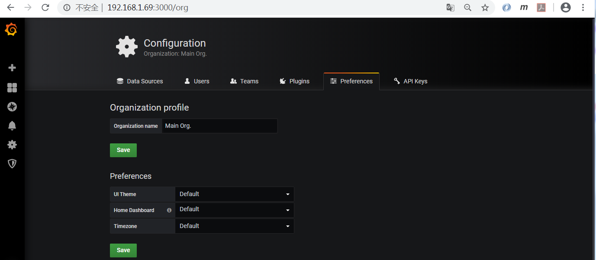
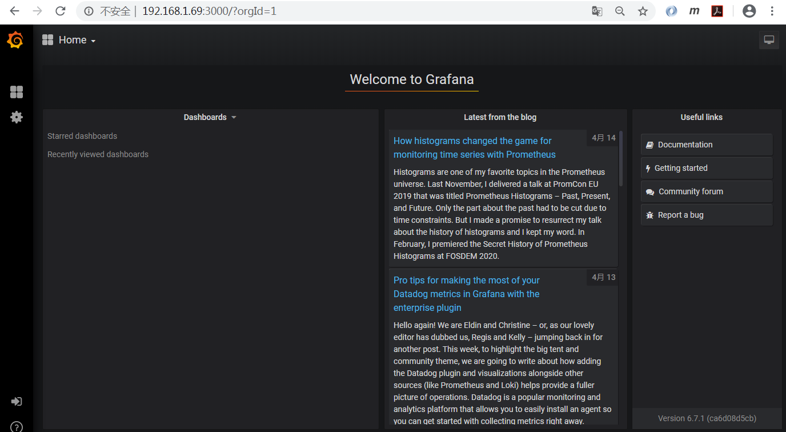
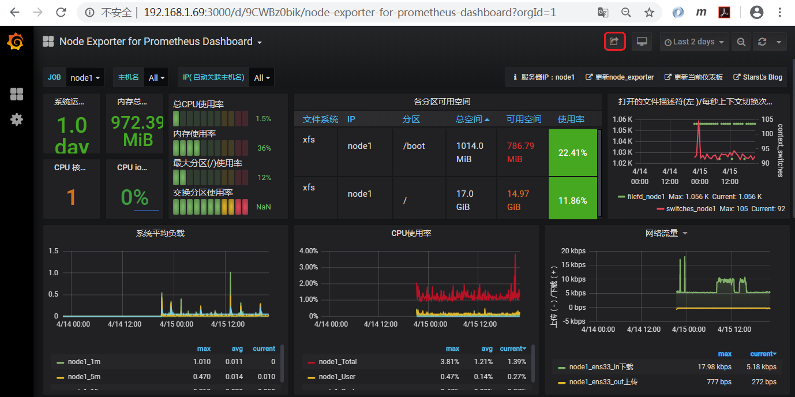
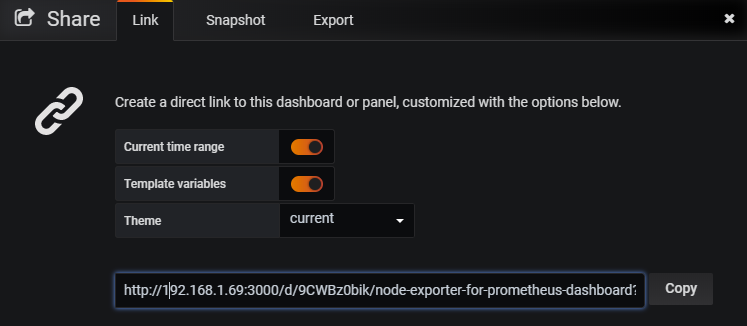
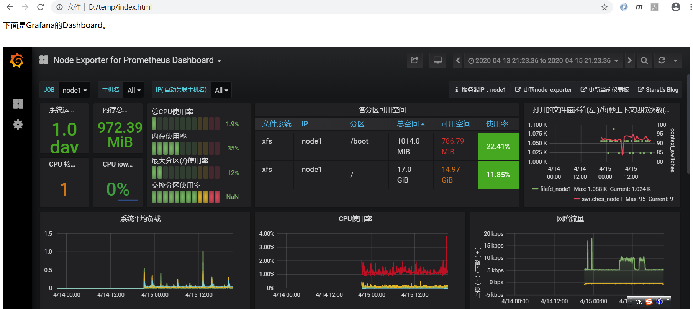
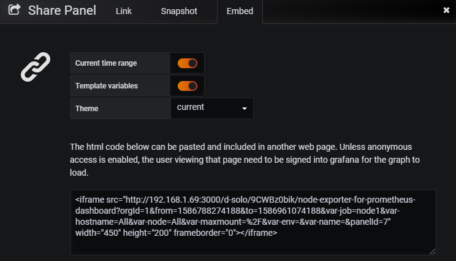
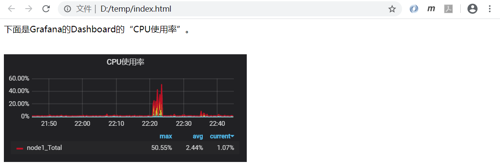
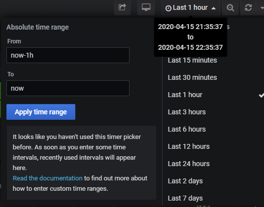
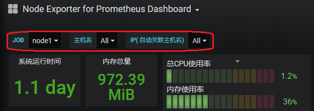
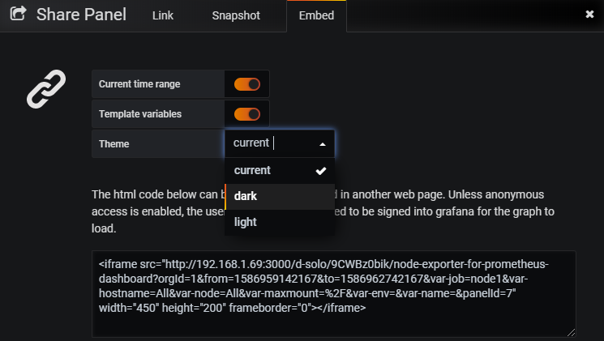

# Grafana匿名登录下通过iframe和业务系统集成

我们可以基于Grafana开发很多很丰富和好看的Dashboard，而且这些Dashboard位于Grafana服务中。有时我们需要将这些Dashboard集成到业务系统，直接作为业务系统的监控的一部分。但Grafana系统本身有自己的用户和认证机制，是无法直接将Dashboard引入到业务系统页面中的。

可以通过启用匿名登录，并在业务系统使用iframe很容易实现这一想法，下面我们对此方案进行说明。

先看一下grafana的版本。

    grafana-server -v
    Version 6.7.1 (commit: ca6d08d5cb, branch: HEAD)

修改grafana配置文件。启用匿名登录；并且允许页面嵌入。注意删除配置前面的分号"；"。

    vi /etc/grafana/grafana.ini
    ......
    #################################### Anonymous Auth ######################
    [auth.anonymous]
    # enable anonymous access
    enabled = true

    # specify organization name that should be used for unauthenticated users
    ;org_name = Main Org.
    
    # specify role for unauthenticated users
    ;org_role = Viewer
    
    ......
    
    # set to true if you want to allow browsers to render Grafana in a <frame>, <iframe>, <embed> or <object>. default is false.
    allow_embedding = true
    ......

> 注意，Grafana安装已经初始化了一个组织名称"Main Org."，匿名登录缺省使用的就是"Main Org.",所以此处无需配置，保留注释状态即可。

> 启用匿名登录时也可以使用用户名登录，只需要输入完整地址[http://192.168.1.69:3000/login](http://192.168.1.69:3000/login)即可。可以在此页面修改org_name。

> 注意，匿名登录的缺省角色为Viewer。

重启grafana服务。

    systemctl restart grafana-server

此时访问[http://192.168.1.69:3000/](http://192.168.1.69:3000/)，可以发现无需登录直接进入首页。可以发现为只读角色，不能修改修改任何配置。

切换到Dashboard。

首先我们尝试直接将这个dashboard嵌入到业务系统中，点击左上角的“Share dashboard”。拷贝共享链接[http://192.168.1.69:3000/d/9CWBz0bik/node-exporter-for-prometheus-dashboard?orgId=1&from=1586787322039&to=1586960122040&var-job=node1&var-hostname=All&var-node=All&var-maxmount=%2F&var-env=&var-name=](http://192.168.1.69:3000/d/9CWBz0bik/node-exporter-for-prometheus-dashboard?orgId=1&from=1586787322039&to=1586960122040&var-job=node1&var-hostname=All&var-node=All&var-maxmount=%2F&var-env=&var-name=)。

创建一个index.html文件，其中包含一个iframe。

    # index.html内容
    

    下面是Grafana的Dashboard。
    

     
    <iframe id="mainIframe" name="mainIframe" src="http://192.168.1.69:3000/d/9CWBz0bik/node-exporter-for-prometheus-dashboard?orgId=1&from=1586784216382&to=1586957016382&var-job=node1&var-hostname=All&var-node=All&var-maxmount=%2F&var-env=&var-name=
    " frameborder="0" scrolling="auto" height="650" width="100%" align="middle"></iframe>

在浏览器中打开该文件。

我们再尝试嵌入Dashboard中的一个Panel，如CPU使用率。鼠标放到“CPU使用率”上，点击展开动作栏，再点击Share按钮，切到Embed页签。

将链接拷贝到index.html中。

    # index.html内容
    

    下面是Grafana的Dashboard的“CPU使用率”。
    

     
    <iframe src="http://192.168.1.69:3000/d-solo/9CWBz0bik/node-exporter-for-prometheus-dashboard?orgId=1&from=1586958297422&to=1586961897423&var-job=node1&var-hostname=All&var-node=All&var-maxmount=%2F&var-env=&var-name=&panelId=7" width="450" height="200" frameborder="0"></iframe>

在浏览器中打开该文件。

> Current time range：是不是使用当前Panel的时间范围。

> Template variables：是不是使用Dashboard当前的模板变量。

> Theme：使用的主题。

