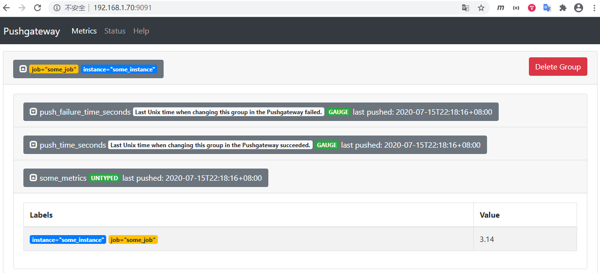

# Prometheus+Altermanger+Grafana+node-exporter安装和使用

- ### 简述

Prometheus是一个开源的系统监控和警报工具，该项目拥有非常活跃的开发人员和用户社区。它现在是一个独立的开源项目，独立于任何公司进行维护。Prometheus于2016年加入CNCF（云原生计算基金会），成为继 Kubernetes之后的第二个托管项目。2018年8月9日，CNCF宣布开放源代码监控工具 Prometheus已从孵化状态进入毕业状态。

Prometheus的主要特性：

- 一个多维数据模型，包含由metric和key/value标识的时间序列数据
- PromQL是一种灵活的查询语言
- 不依赖分布式存储，单个服务器节点是自治的
- 基于HTTP协议通过pull形式进行收集时间序列数据
- push形式的时间序列数据是通过一个中间网关来支持的
- targets可以通过服务发现或静态配置发现的
- 多种模式的图形和仪表盘支持

下图描述了Prometheus的架构和生态系统。

- Prometheus Server：用于收集和存储时间序列数据。
- Client Library：客户端库，为需要监控的服务生成相应的metrics并暴露给Prometheus Server。当Prometheus Server来pull时，直接返回实时状态的metrics。
- Push Gateway：主要用于短期的jobs。由于这类jobs存在时间较短，可能在Prometheus来pull之前就消失了。为此，这类jobs可以直接向Prometheus Server端推送它们的metrics。这种方式主要用于服务层面的metrics，对于机器层面的metrices，需要使用node exporter。
- Exporters：用于暴露已有的第三方服务的metrics给Prometheus。
- Alertmanager：从Prometheus Server端接收到Alerts后，会进行去除重复数据，分组，并路由到不同的告警接收方式，发出报警。常见的接收方式有：电子邮件，pagerduty，OpsGenie, webhook等。
- Web UI：Prometheus内置一个简单的Web控制台，可以查询指标，查看配置信息或者Service Discovery等，实际工作中，查看指标或者创建仪表盘通常使用Grafana，Prometheus作为Grafana的数据源。

- ### 安装环境

| IP | 主机名 | 安装软件 |
| :------| :------ | :------ |
| 192.168.1.69 | prometheus-node1 | prometheus, node-exporter, grafana |
| 192.168.1.70 | prometheus-node2 | node-exporter, alertmanager, pushgateway |

操作系统版本。

    cat /etc/redhat-release
    CentOS Linux release 7.7.1908 (Core)

- ### 安装Prometheus

下载[https://github.com/prometheus/prometheus/releases/download/v2.16.0/prometheus-2.16.0.linux-amd64.tar.gz](https://github.com/prometheus/prometheus/releases/download/v2.16.0/prometheus-2.16.0.linux-amd64.tar.gz)。然后上传prometheus-2.16.0.linux-amd64.tar.gz到prometheus-node1节点并安装prometheus。

    tar xzvf prometheus-2.16.0.linux-amd64.tar.gz
    mkdir /usr/local/prometheus
    mv prometheus-2.16.0.linux-amd64 /usr/local/prometheus/prometheus
    cd /usr/local/prometheus/prometheus

查看版本号。

    ./prometheus --version
    prometheus, version 2.16.0 (branch: HEAD, revision: b90be6f32a33c03163d700e1452b54454ddce0ec)
      build user:       root@7ea0ae865f12
      build date:       20200213-23:50:02
      go version:       go1.13.8

启动prometheus进程。

    ./prometheus
    level=info ts=2020-03-23T15:23:27.799Z caller=main.go:295 msg="no time or size retention was set so using the default time retention" duration=15d
    level=info ts=2020-03-23T15:23:27.799Z caller=main.go:331 msg="Starting Prometheus" version="(version=2.16.0, branch=HEAD, revision=b90be6f32a33c03163d700e1452b54454ddce0ec)"
    level=info ts=2020-03-23T15:23:27.799Z caller=main.go:332 build_context="(go=go1.13.8, user=root@7ea0ae865f12, date=20200213-23:50:02)"
    level=info ts=2020-03-23T15:23:27.799Z caller=main.go:333 host_details="(Linux 3.10.0-1062.18.1.el7.x86_64 #1 SMP Tue Mar 17 23:49:17 UTC 2020 x86_64 prometheus (none))"
    level=info ts=2020-03-23T15:23:27.799Z caller=main.go:334 fd_limits="(soft=1024, hard=4096)"
    level=info ts=2020-03-23T15:23:27.800Z caller=main.go:335 vm_limits="(soft=unlimited, hard=unlimited)"
    level=info ts=2020-03-23T15:23:27.809Z caller=main.go:661 msg="Starting TSDB ..."
    level=info ts=2020-03-23T15:23:27.811Z caller=web.go:508 component=web msg="Start listening for connections" address=0.0.0.0:9090
    level=info ts=2020-03-23T15:23:27.817Z caller=repair.go:59 component=tsdb msg="found healthy block" mint=1584947587486 maxt=1584950400000 ulid=01E43E3D9ECWQY6T5HZ04R15PX
    level=info ts=2020-03-23T15:23:27.818Z caller=repair.go:59 component=tsdb msg="found healthy block" mint=1584950400000 maxt=1584957600000 ulid=01E43GSF6T3PQRD2BN4XFHN52Y
    level=info ts=2020-03-23T15:23:27.819Z caller=repair.go:59 component=tsdb msg="found healthy block" mint=1584957600000 maxt=1584964800000 ulid=01E43QN6EDJH3J5CP4F00MY8DN
    level=info ts=2020-03-23T15:23:27.852Z caller=head.go:577 component=tsdb msg="replaying WAL, this may take awhile"
    level=info ts=2020-03-23T15:23:27.966Z caller=head.go:625 component=tsdb msg="WAL segment loaded" segment=0 maxSegment=7
    level=info ts=2020-03-23T15:23:27.987Z caller=head.go:625 component=tsdb msg="WAL segment loaded" segment=1 maxSegment=7
    level=info ts=2020-03-23T15:23:28.100Z caller=head.go:625 component=tsdb msg="WAL segment loaded" segment=2 maxSegment=7
    level=info ts=2020-03-23T15:23:28.192Z caller=head.go:625 component=tsdb msg="WAL segment loaded" segment=3 maxSegment=7
    level=info ts=2020-03-23T15:23:28.193Z caller=head.go:625 component=tsdb msg="WAL segment loaded" segment=4 maxSegment=7
    level=info ts=2020-03-23T15:23:28.195Z caller=head.go:625 component=tsdb msg="WAL segment loaded" segment=5 maxSegment=7
    level=info ts=2020-03-23T15:23:28.195Z caller=head.go:625 component=tsdb msg="WAL segment loaded" segment=6 maxSegment=7
    level=info ts=2020-03-23T15:23:28.195Z caller=head.go:625 component=tsdb msg="WAL segment loaded" segment=7 maxSegment=7
    level=info ts=2020-03-23T15:23:28.198Z caller=main.go:676 fs_type=XFS_SUPER_MAGIC
    level=info ts=2020-03-23T15:23:28.198Z caller=main.go:677 msg="TSDB started"
    level=info ts=2020-03-23T15:23:28.198Z caller=main.go:747 msg="Loading configuration file" filename=prometheus.yml
    level=info ts=2020-03-23T15:23:28.204Z caller=main.go:775 msg="Completed loading of configuration file" filename=prometheus.yml
    level=info ts=2020-03-23T15:23:28.205Z caller=main.go:630 msg="Server is ready to receive web requests."

访问prometheus，[http://192.168.1.69:9090/](http://192.168.1.69:9090/)。

也可以访问prometheus自监控指标，[http://192.168.1.69:9090/metrics](http://192.168.1.69:9090/metrics)。

停止进程可以使用ctl+c。

    ^Clevel=warn ts=2020-03-23T15:23:30.646Z caller=main.go:507 msg="Received SIGTERM, exiting gracefully..."
    level=info ts=2020-03-23T15:23:30.646Z caller=main.go:530 msg="Stopping scrape discovery manager..."
    level=info ts=2020-03-23T15:23:30.646Z caller=main.go:544 msg="Stopping notify discovery manager..."
    level=info ts=2020-03-23T15:23:30.646Z caller=main.go:566 msg="Stopping scrape manager..."
    level=info ts=2020-03-23T15:23:30.647Z caller=manager.go:845 component="rule manager" msg="Stopping rule manager..."
    level=info ts=2020-03-23T15:23:30.647Z caller=manager.go:851 component="rule manager" msg="Rule manager stopped"
    level=info ts=2020-03-23T15:23:30.647Z caller=main.go:526 msg="Scrape discovery manager stopped"
    level=info ts=2020-03-23T15:23:30.647Z caller=main.go:540 msg="Notify discovery manager stopped"
    level=info ts=2020-03-23T15:23:30.647Z caller=main.go:560 msg="Scrape manager stopped"
    level=info ts=2020-03-23T15:23:30.648Z caller=notifier.go:598 component=notifier msg="Stopping notification manager..."
    level=info ts=2020-03-23T15:23:30.648Z caller=main.go:731 msg="Notifier manager stopped"
    level=info ts=2020-03-23T15:23:30.649Z caller=main.go:743 msg="See you next time!"

设置自启动服务。

    vi /etc/systemd/system/prometheus.service
    [Unit]
    Description=prometheus
    After=network.target
    
    [Service]
    Type=simple
    User=root
    ExecStart=/usr/local/prometheus/prometheus/prometheus --config.file=/usr/local/prometheus/prometheus/prometheus.yml
    Restart=on-failure
    
    [Install]
    WantedBy=multi-user.target

    systemctl start prometheus
    systemctl enable prometheus

- ### 安装node_exporter

下载[https://github.com/prometheus/node_exporter/releases/download/v0.18.1/node_exporter-0.18.1.linux-amd64.tar.gz](https://github.com/prometheus/node_exporter/releases/download/v0.18.1/node_exporter-0.18.1.linux-amd64.tar.gz)。然后上传node_exporter-0.18.1.linux-amd64.tar.gz并安装node_exporter。注意在prometheus-node1和prometheus-node2节点都安装。

    tar zxvf node_exporter-0.18.1.linux-amd64.tar.gz
    mkdir /usr/local/prometheus
    mv node_exporter-0.18.1.linux-amd64 /usr/local/prometheus/node_exporter

查看node-exporter版本号。

    /usr/local/prometheus/node_exporter/node_exporter --version
    node_exporter, version 0.18.1 (branch: HEAD, revision: 3db77732e925c08f675d7404a8c46466b2ece83e)
      build user:       root@b50852a1acba
      build date:       20190604-16:41:18
      go version:       go1.12.5

设置自启动服务。

    vi /etc/systemd/system/node_exporter.service
    [Unit]
    Description=node_export
    Documentation=https://github.com/prometheus/node_exporter
    After=network.target
     
    [Service]
    Type=simple
    User=root
    ExecStart=/usr/local/prometheus/node_exporter/node_exporter
    Restart=on-failure
    
    [Install]
    WantedBy=multi-user.target

    systemctl start node_exporter.service
    systemctl status node_exporter.service
    systemctl enable node_exporter.service

访问[http://192.168.1.69:9100/metrics](http://192.168.1.69:9100/metrics)可以获取监控指标。

- ### 配置Prometheus

scrape_configs块控制Prometheus监控的资源。 由于Prometheus还将自己的数据公开为HTTP端点，因此它可以抓取并监控自身的健康状况。 在默认配置中，有一个名为prometheus的作业，它会抓取Prometheus服务器公开的时间序列数据。该作业包含一个静态配置的目标，即端口9090上的localhost（此处改为本机地址192.168.1.69），监控数据从[http://192.168.1.69:9090/metrics](http://192.168.1.69:9090/metrics)抓取。

在prometheus-node1和prometheus-node2节点上都安装了node-exporter，所以相应都配置了job。

    vi /usr/local/prometheus/prometheus/prometheus.yml
    # my global config
    global:
      scrape_interval:     15s # Set the scrape interval to every 15 seconds. Default is every 1 minute.
      evaluation_interval: 15s # Evaluate rules every 15 seconds. The default is every 1 minute.
      # scrape_timeout is set to the global default (10s).
    
    # Alertmanager configuration
    alerting:
      alertmanagers:
      - static_configs:
        - targets:
          # - alertmanager:9093
    
    # Load rules once and periodically evaluate them according to the global 'evaluation_interval'.
    rule_files:
      # - "first_rules.yml"
      # - "second_rules.yml"
    
    # A scrape configuration containing exactly one endpoint to scrape:
    # Here it's Prometheus itself.
    scrape_configs:
      - job_name: 'prometheus'
        static_configs:
        - targets: ['192.168.1.69:9090']
          labels:
            instance: prometheus
    
      - job_name: 'node1'
        static_configs:
        - targets: ['192.168.1.69:9100']
          labels:
            instance: node1
    
      - job_name: 'node2'
        static_configs:
        - targets: ['192.168.1.70:9100']
          labels:
            instance: node2

访问Prometheus查看定义的目标主机[http://192.168.1.69:9090/targets](http://192.168.1.69:9090/targets)。

- ### 安装Alertmanager

下载[https://github.com/prometheus/alertmanager/releases/download/v0.20.0/alertmanager-0.20.0.linux-amd64.tar.gz](https://github.com/prometheus/alertmanager/releases/download/v0.20.0/alertmanager-0.20.0.linux-amd64.tar.gz)。然后上传alertmanager-0.20.0.linux-amd64.tar.gz到prometheus-node2，并安装Alertmanager。

    tar zxvf alertmanager-0.20.0.linux-amd64.tar.gz
    mv alertmanager-0.20.0.linux-amd64 /usr/local/prometheus/alertmanager

查看alertmanager版本号。

    /usr/local/prometheus/alertmanager/alertmanager --version
    alertmanager, version 0.20.0 (branch: HEAD, revision: f74be0400a6243d10bb53812d6fa408ad71ff32d)
      build user:       root@00c3106655f8
      build date:       20191211-14:13:14
      go version:       go1.13.5

设置自启动服务。

    vi /etc/systemd/system/alertmanager.service
    [Unit]
    Description=Alertmanager
    After=network.target
    
    [Service]
    Type=simple
    User=root
    ExecStart=/usr/local/prometheus/alertmanager/alertmanager --config.file=/usr/local/prometheus/alertmanager/alertmanager.yml
    Restart=on-failure
    
    [Install]
    WantedBy=multi-user.target

    systemctl start alertmanager.service
    systemctl status alertmanager.service
    systemctl enable alertmanager.service

访问Alertmanager，[http://192.168.1.70:9093/](http://192.168.1.70:9093/)。

修改prometheus.yml将alertmanagers加入监控目标。

    vi /usr/local/prometheus/prometheus/prometheus.yml
    # my global config
    global:
      scrape_interval:     15s # Set the scrape interval to every 15 seconds. Default is every 1 minute.
      evaluation_interval: 15s # Evaluate rules every 15 seconds. The default is every 1 minute.
      # scrape_timeout is set to the global default (10s).
    
    # Alertmanager configuration
    alerting:
      alertmanagers:
      - static_configs:
        - targets: ["192.168.1.70:9093"]
    
    # Load rules once and periodically evaluate them according to the global 'evaluation_interval'.
    rule_files:
      # - "first_rules.yml"
      # - "second_rules.yml"
    
    # A scrape configuration containing exactly one endpoint to scrape:
    # Here it's Prometheus itself.
    scrape_configs:
      - job_name: 'prometheus'
        static_configs:
        - targets: ['192.168.1.69:9090','192.168.1.69:9100']
      - job_name: 'node1'
        static_configs:
        - targets: ['192.168.1.70:9100']

    systemctl stop prometheus
    systemctl start prometheus

可以查看[http://192.168.1.69:9090/config](http://192.168.1.69:9090/config)看配置是否生效。

- ### 配置邮件告警

配置告警规则文件。

    vi /usr/local/prometheus/prometheus/prometheus.yml
    global:
      scrape_interval:     15s # Set the scrape interval to every 15 seconds. Default is every 1 minute.
      evaluation_interval: 15s # Evaluate rules every 15 seconds. The default is every 1 minute.
    
    alerting:
      alertmanagers:
      - static_configs:
        - targets: ["192.168.1.70:9093"]
    
    rule_files:
      - /usr/local/prometheus/prometheus/rules/*.rules
    
    scrape_configs:
      - job_name: 'prometheus'
        static_configs:
        - targets: ['192.168.1.69:9090']
          labels:
            instance: prometheus
    
      - job_name: 'node1'
        static_configs:
        - targets: ['192.168.1.69:9100']
          labels:
            instance: node1
    
      - job_name: 'node2'
        static_configs:
        - targets: ['192.168.1.70:9100']
          labels:
            instance: node2

配置告警规则，"up == 0"表示服务down。

    vi /usr/local/prometheus/prometheus/rules/service_down.rules
    groups:
    - name: ServiceStatus
      rules:
      - alert: ServiceStatusAlert
        expr: up == 0
        for: 1m
        labels:
          project: APP
        annotations:
          summary: "Instance {{ $labels.instance }} down"
          description: "{{ $labels.instance }} of job {{ $labels.job }} has been down for more than 1 minutes."

配置Alertmanager。

    vi /usr/local/prometheus/alertmanager/alertmanager.yml
    global:
      resolve_timeout: 5m
      smtp_smarthost: 'smtp.sina.cn:25'
      smtp_from: 'xxxxxx@sina.cn'
      smtp_auth_username: 'xxxxxx@sina.cn'
      smtp_auth_password: 'yyyyyyy'
    
    templates:
      - 'template/*.tmpl'
    
    route:
      group_by: ['alertname']
      group_wait: 10s
      group_interval: 60s
      repeat_interval: 1h
      receiver: 'email'
    
    receivers:
      - name: 'email'
        email_configs:
        - to: 'xxxxxx@sina.cn'

重启Prometheus和Alertmanager服务。

    systemctl stop prometheus
    systemctl start prometheus
    
    systemctl stop alertmanager
    systemctl start alertmanager

查询服务的启停状态，可以看出三个监控的服务都是启动状态（up == 1表示正常，up == 0表示down）。

在Prometheus中查看alert配置，可以看出ServiceStatusAlert没有激活。

然后停止prometheus-node2节点的node_exporter服务。

    systemctl stop node_exporter

再次查询服务的启停状态，可以看出{instance="node2",job="node2"}服务down了。

node_exporter服务停止后，Prometheus每隔评估周期evaluation_interval（15s）抓取一次，发现告警表达式up == 0为true之后，Prometheus会先将ServiceStatusAlert变成pengding状态。

然后执行for子句，在下一个评估周期中，如果告警表达式仍然为true，则检查for的持续时间（1m）。如果没有超过持续时间，则等待下一个评估周期；如果超过了持续时间，则告警转换为Firing，生成通知并将其推送到Alertmanager。

如果下一个评估周期告警表达式不再为true，则Prometheus会将ServiceStatusAlert的状态从Pending更改回Inactive。

Pending到Firing的转换可以确保告警更有效，且不会来回浮动。没有for子句的告警会自动从Inactive转换为Firing，只需要一个评估周期即可触发。带有for子句的告警将首先转换为Pending，然后转换为Firing，因此至少需要两个评估周期才能触发。

告警可能有以下三种状态：
- Inactive：警报未激活。
- Pending：警报已满足告警表达式条件，但仍在等待for子句中指定的持续时间。
- Firing：警报已满足告警表达式条件，并且Pending的时间已超过for子句的持续时间。

查看邮箱可以看出已经收到告警邮件。

在Alertmanager的[http://192.168.1.70:9093/#/alerts](http://192.168.1.70:9093/#/alerts)可以看到该告警。

- ### 安装Grafana

下载[https://dl.grafana.com/oss/release/grafana-6.7.1-1.x86_64.rpm](https://dl.grafana.com/oss/release/grafana-6.7.1-1.x86_64.rpm)。然后上传grafana-6.7.1-1.x86_64.rpm到prometheus-node1节点并安装grafana。

    yum install -y grafana-6.7.1-1.x86_64.rpm
    systemctl start grafana-server.service
    systemctl status grafana-server.service
    systemctl enable grafana-server.service

查看版本号。

    /usr/local/prometheus/grafana/bin/grafana-server -v

访问Grafana，[http://192.168.1.69:3000/](http://192.168.1.69:3000/)，使用admin/admin登录。

- ### 导入预先构建看板Dashboard

点击"Add data source"，选择Prometheus作为数据源。

在URL输入框键入[http://192.168.1.69:9090](http://192.168.1.69:9090)，点击"Save & Test"按钮，如果出现下图中的绿色"Data source is working"提示，则表示配置有效。

下面我们需要创建Dashboard看板，我们可以从Grafana官方的预先构建Dashboards列表中选择一个，[https://grafana.com/grafana/dashboards](https://grafana.com/grafana/dashboards)，Grafana提供了很多不同数据源的预先构建的Dashboard，我们可以直接使用这些预先构建的Dashboard，而无需自己创建Dashboard。我们选择第一个并下载下来，文件名为1-node-exporter-for-prometheus-dashboard-update-1102_rev11.json。

回到Grafana首页，点击"New dashboard"，创建看板。

再点击左上角的"New dashboard"。

选择"import dashboard"。

点击"Upload .json file"按钮，将刚才下载的文件上传。

Name可以自行修改，folder选择General，Prometheus Data Source选择Prometheus，然后导入。

可以看到Prometheus数据源的看板，可以切换job，主机名等。

- ### 创建看板Dashboard

在"New dashboard"页面点击"Add Query"。

选择Prometheus数据源，我们展示CPU使用率metrics："100 - (avg(irate(node_cpu_seconds_total{mode="idle"}[5m])) by (instance) * 100)"。

Title输入"CPU使用率"，然后点击右上角的保存图标。

Dashboard起名为"测试用Prometheus Dashboard"。

### 安装Pushgateway

下载[https://github.com/prometheus/pushgateway/releases/download/v1.2.0/pushgateway-1.2.0.linux-amd64.tar.gz](https://github.com/prometheus/pushgateway/releases/download/v1.2.0/pushgateway-1.2.0.linux-amd64.tar.gz)。然后上传pushgateway-1.2.0.linux-amd64.tar.gz并安装Pushgateway。

    tar zxvf pushgateway-1.2.0.linux-amd64.tar.gz
    mv pushgateway-1.2.0.linux-amd64 /usr/local/prometheus/pushgateway

查看Pushgateway版本号。

    /usr/local/prometheus/pushgateway/pushgateway --version
    pushgateway, version 1.2.0 (branch: HEAD, revision: b7e0167e9574f4f88404dde9653ee1d3c940f2eb)
      build user:       root@0e823ccfff84
      build date:       20200311-18:51:01
      go version:       go1.13.8

设置自启动服务。

    vi /etc/systemd/system/pushgateway.service
    [Unit]
    Description=Pushgateway
    After=network.target

    [Service]
    Type=simple
    User=root
    ExecStart=/usr/local/prometheus/pushgateway/pushgateway
    Restart=on-failure

    [Install]
    WantedBy=multi-user.target

    systemctl start pushgateway.service
    systemctl status pushgateway.service
    systemctl enable pushgateway.service

更新Prometheus配置。

    vi /usr/local/prometheus/prometheus/prometheus.yml
    ......
      - job_name: 'pushgateway'
        static_configs:
        - targets: ['192.168.1.70:9091']
          labels:
            instance: prom-node2
    ......

    systemctl restart prometheus

通常可以通过调用client libraries导入指标数据，也可以通过API向Pushgateway导入指标数据。

    echo "some_metrics 3.14" | curl --data-binary @- http://192.168.1.70:9091/metrics/job/some_job/instance/some_instance

访问Pushgateway，[http://192.168.1.70:9091/](http://192.168.1.70:9091/)。可以看到刚才导入的指标数据。

可以在Prometheus中查看指标数据，也就是Prometheus已经从Pushgateway抓取到了数据。

    some_metrics{exported_instance="some_instance",exported_job="some_job",instance="prom-node2",job="pushgateway"}             3.14

也可以一次性导入多个指标数据。

    cat <<EOF | curl --data-binary @- http://192.168.1.70:9091/metrics/job/some_job/instance/some_instance
    # TYPE some_metrics_2 counter
    some_metrics_2{label_name="label_value_1"} 33
    some_metrics_2{label_name="label_value_2"} 33
    # HELP some_metrics_3 some metrics 3
    # TYPE some_metrics_3 gauge
    some_metrics_3{label_name="label_value_1"} 22
    some_metrics_3{label_name="label_value_2"} 35
    EOF
