# Prometheus配置说明

一、配置文件
要指定要加载的配置文件，请使用--config.file标志。

该文件以YAML格式编写，由下面描述的方案定义。 括号表示参数是可选的。 对于非列表参数，该值设置为指定的默认值。

通用占位符定义如下：

- \<boolean>：一个可以取值为true或false的布尔值
- \<duration>：与正则表达式匹配的持续时间[0-9] +（ms | [smhdwy]）
- \<labelname>：与正则表达式匹配的字符串[a-zA-Z _] [a-zA-Z0-9 _] *
- \<labelvalue>：一串unicode字符
- \<filename>：当前工作目录中的有效路径
- \<host>：由主机名或IP后跟可选端口号组成的有效字符串
- \<path>：有效的URL路径
- \<scheme>：一个可以取值http或https的字符串
- \<string>：常规字符串
- \<secret>：一个秘密的常规字符串，例如密码
- \<tmpl_string>：在使用前进行模板扩展的字符串

其他占位符是单独指定的。

### 全局配置

全局配置指定在所有其他配置上下文中有效的参数。它们还可用作其他配置段的默认值。

    global:
      # 默认情况下抓取目标的频率.
      [ scrape_interval: <duration> | default = 1m ]
    
      # 抓取超时时间.
      [ scrape_timeout: <duration> | default = 10s ]
    
      # 评估规则的频率.
      [ evaluation_interval: <duration> | default = 1m ]
    
      # 与外部系统通信时添加到任何时间序列或警报的标签
      #（联合，远程存储，Alertma# nager）.
      external_labels:
        [ <labelname>: <labelvalue> ... ]
    
    # 规则文件指定了一个globs列表. 
    # 从所有匹配的文件中读取规则和警报.
    rule_files:
      [ - <filepath_glob> ... ]
    
    # 抓取配置列表.
    scrape_configs:
      [ - <scrape_config> ... ]
    
    # 警报指定与Alertmanager相关的设置.
    alerting:
      alert_relabel_configs:
        [ - <relabel_config> ... ]
      alertmanagers:
        [ - <alertmanager_config> ... ]
    
    # 与远程写入功能相关的设置.
    remote_write:
      [ - <remote_write> ... ]
    
    # 与远程读取功能相关的设置.
    remote_read:
      [ - <remote_read> ... ]

### \<scrape_config>

\<scrape_config>部分指定一组描述如何刮除它们的目标和参数。 在一般情况下，一个scrape配置指定单个作业。 在高级配置中，这可能会改变。

目标可以通过\<static_configs>参数静态配置，也可以使用其中一种支持的服务发现机制动态发现。

此外，\<relabel_configs>允许在抓取之前对任何目标及其标签进行高级修改。

其中\<job_name>在所有scrape配置中必须是唯一的。

    # 默认分配给已抓取指标的job名称。
    job_name: <job_name>
    
    # 从job中抓取目标的频率.
    [ scrape_interval: <duration> | default = <global_config.scrape_interval> ]
    
    # 抓取此job时，每次抓取超时时间.
    [ scrape_timeout: <duration> | default = <global_config.scrape_timeout> ]
    
    # 从目标获取指标的HTTP资源路径.
    [ metrics_path: <path> | default = /metrics ]
    
    # honor_labels控制Prometheus如何处理已经存在于已抓取数据中的标签与Prometheus将附加服务器端的标签之间的冲突（"job"和"instance"标签，手动配置的目标标签以及服务发现实现生成的标签）。
    # 
    # 如果honor_labels设置为"true"，则通过保留已抓取数据的标签值并忽略冲突的服务器端标签来解决标签冲突。
    #
    # 如果honor_labels设置为"false"，则通过将已抓取数据中的冲突标签重命名为"exported_ <original-label>"（例如"exported_instance"，"exported_job"）然后附加服务器端标签来解决标签冲突。 这对于联合等用例很有用，其中应保留目标中指定的所有标签。
    # 
    # 请注意，任何全局配置的"external_labels"都不受此设置的影响。 在与外部系统通信时，它们始终仅在时间序列尚未具有给定标签时应用，否则将被忽略。
    # 
    [ honor_labels: <boolean> | default = false ]
    
    # 配置用于请求的协议方案.
    [ scheme: <scheme> | default = http ]
    
    # 可选的HTTP URL参数.
    params:
      [ <string>: [<string>, ...] ]
    
    # 使用配置的用户名和密码在每个scrape请求上设置`Authorization`标头。 password和password_file是互斥的。
    basic_auth:
      [ username: <string> ]
      [ password: <secret> ]
      [ password_file: <string> ]
    
    # 使用配置的承载令牌在每个scrape请求上设置`Authorization`标头。 它`bearer_token_file`和是互斥的。
    [ bearer_token: <secret> ]
    
    # 使用配置的承载令牌在每个scrape请求上设置`Authorization`标头。 它`bearer_token`和是互斥的。
    [ bearer_token_file: /path/to/bearer/token/file ]
    
    # 配置scrape请求的TLS设置.
    tls_config:
      [ <tls_config> ]
    
    # 可选的代理URL.
    [ proxy_url: <string> ]
    
    # Azure服务发现配置列表.
    azure_sd_configs:
      [ - <azure_sd_config> ... ]
    
    # Consul服务发现配置列表.
    consul_sd_configs:
      [ - <consul_sd_config> ... ]
    
    # DNS服务发现配置列表。
    dns_sd_configs:
      [ - <dns_sd_config> ... ]
    
    # EC2服务发现配置列表。
    ec2_sd_configs:
      [ - <ec2_sd_config> ... ]
    
    # OpenStack服务发现配置列表。
    openstack_sd_configs:
      [ - <openstack_sd_config> ... ]
    
    # 文件服务发现配置列表。
    file_sd_configs:
      [ - <file_sd_config> ... ]
    
    # GCE服务发现配置列表。
    gce_sd_configs:
      [ - <gce_sd_config> ... ]
    
    # Kubernetes服务发现配置列表。
    kubernetes_sd_configs:
      [ - <kubernetes_sd_config> ... ]
    
    # Marathon服务发现配置列表。
    marathon_sd_configs:
      [ - <marathon_sd_config> ... ]
    
    # AirBnB的神经服务发现配置列表。
    nerve_sd_configs:
      [ - <nerve_sd_config> ... ]
    
    # Zookeeper Serverset服务发现配置列表。
    serverset_sd_configs:
      [ - <serverset_sd_config> ... ]
    
    # Triton服务发现配置列表。
    triton_sd_configs:
      [ - <triton_sd_config> ... ]
    
    # 此job的标记静态配置目标列表。
    static_configs:
      [ - <static_config> ... ]
    
    # 目标重新标记配置列表。
    relabel_configs:
      [ - <relabel_config> ... ]
    
    # 度量标准重新配置列表。
    metric_relabel_configs:
      [ - <relabel_config> ... ]
    
    # 对每个将被接受的样本数量的每次抓取限制。
    # 如果在度量重新标记后存在超过此数量的样本，则整个抓取将被视为失败。 0表示没有限制。
    [ sample_limit: <int> | default = 0 ]

- ### 说明

Prometheus-Operator官方提供的架构图：

Operator是最核心的部分，作为一个控制器，他会去创建Prometheus、PodMonitor、ServiceMonitor、AlertManager以及PrometheusRule这5个CRD资源对象，然后会一直监控并维持这5个资源对象的状态。

其中创建的Prometheus这种资源对象就是作为Prometheus Server存在，而PodMonitor和ServiceMonitor就是exporter的各种抽象，是用来提供专门提供metrics数据接口的工具，Prometheus就是通过PodMonitor和ServiceMonitor提供的metrics数据接口去pull数据的，当然alertmanager这种资源对象就是对应的AlertManager的抽象，而PrometheusRule是用来被Prometheus实例使用的报警规则文件。

这样我们要在集群中监控什么数据，就变成了直接去操作 Kubernetes 集群的资源对象了，是不是方便很多了。上图中的 Service 和 ServiceMonitor 都是 Kubernetes 的资源，一个 ServiceMonitor 可以通过 labelSelector 的方式去匹配一类 Service，Prometheus 也可以通过 labelSelector 去匹配多个ServiceMonitor。

- ### 安装

下载[https://github.com/coreos/kube-prometheus](https://github.com/coreos/kube-prometheus)，最好下载最新的Release版本。本文下载[https://github.com/coreos/kube-prometheus/archive/v0.3.0.tar.gz](https://github.com/coreos/kube-prometheus/archive/v0.3.0.tar.gz)。

    mkdir prometheus
    cd prometheus/

上传kube-prometheus-0.3.0.tar.gz，开始安装。

    tar zxvf kube-prometheus-0.3.0.tar.gz
    
    cd kube-prometheus-0.3.0/manifests/setup/

    kubectl apply -f .
    namespace/monitoring created
    customresourcedefinition.apiextensions.k8s.io/alertmanagers.monitoring.coreos.com created
    customresourcedefinition.apiextensions.k8s.io/podmonitors.monitoring.coreos.com created
    customresourcedefinition.apiextensions.k8s.io/prometheuses.monitoring.coreos.com created
    customresourcedefinition.apiextensions.k8s.io/prometheusrules.monitoring.coreos.com created
    customresourcedefinition.apiextensions.k8s.io/servicemonitors.monitoring.coreos.com created
    clusterrole.rbac.authorization.k8s.io/prometheus-operator created
    clusterrolebinding.rbac.authorization.k8s.io/prometheus-operator created
    deployment.apps/prometheus-operator created
    service/prometheus-operator created
    serviceaccount/prometheus-operator created

查看创建的CRDs。

    kubectl get crd | grep coreos
    alertmanagers.monitoring.coreos.com     2020-03-26T12:27:08Z
    podmonitors.monitoring.coreos.com       2020-03-26T12:27:08Z
    prometheuses.monitoring.coreos.com      2020-03-26T12:27:09Z
    prometheusrules.monitoring.coreos.com   2020-03-26T12:27:10Z
    servicemonitors.monitoring.coreos.com   2020-03-26T12:27:11Z

默认情况下，`prometheus-serviceMonitorKubelet.yaml`关联的kubelet的https-metrics（10250）端口拉取metrics数据，为了安全起见，kubelet关闭了匿名认证并开启了webhook授权，访问https-metrics端口需要认证和授权。http-metrics(10255)为只读端口，无须认证和授权。但默认情况下是不打开的，可以如下配置打开该端口。注意所有安装了kubelet服务的集群主机都需要配置。

    vi /var/lib/kubelet/config.yaml
    readOnlyPort: 10255
    
    systemctl restart kubelet

然后将prometheus-serviceMonitorKubelet.yaml文件中的https-metrics更改成http-metrics即可。

    cd ..
    vi prometheus-serviceMonitorKubelet.yaml
        port: https-metrics
        scheme: https
    #改为
        port: http-metrics
        scheme: http

为了Kubernetes集群外访问prometheus、grafana和alertmanager，可以配置NodePort或者Ingress，此处简单起见，直接修改为NodePort。

    vi prometheus-service.yaml
      type: NodePort
        nodePort: 39090

    vi grafana-service.yaml
      type: NodePort
        nodePort: 33000

    vi alertmanager-service.yaml
      type: NodePort
        nodePort: 39093

`prometheus-serviceMonitorKubeScheduler.yaml`定义了监控kube-scheduler的ServiceMonitor。serviceMonitorKubeScheduler通过`k8s-app=kube-scheduler`和kube-scheduler服务关联，但Kubernetes缺省没有创建该service。可以先看一下对应的kube-scheduler-k8s-master这个pod，然后直接在manifests目录下定义kube-scheduler服务，下面统一部署。10251是kube-scheduler服务metrics数据所在的端口。

> kube-scheduler：调度器主要负责为新创建的pod在集群中寻找最合适的node，并将pod调度到Node上。

    kubectl get pod kube-scheduler-k8s-master -nkube-system --show-labels
    NAME                        READY   STATUS    RESTARTS   AGE    LABELS
    kube-scheduler-k8s-master   1/1     Running   4          103d   component=kube-scheduler,tier=control-plane
    
    vi prometheus-kubeSchedulerService.yaml
    apiVersion: v1
    kind: Service
    metadata:
      namespace: kube-system
      name: kube-scheduler
      labels:
        k8s-app: kube-scheduler
    spec:
      selector:
        component: kube-scheduler
      ports:
      - name: http-metrics
        port: 10251
        targetPort: 10251
        protocol: TCP

同样，`prometheus-serviceMonitorKubeControllerManager.yaml`定义了监控kube-controller-manager的ServiceMonitor。serviceMonitorKubeControllerManager通过`k8s-app: kube-controller-manager`和kube-controller-manager服务关联，但Kubernetes缺省没有创建该service。可以先看一下对应的kube-controller-manager-k8s-master这个pod，然后直接在manifests目录下定义kube-controller-manager服务。10252是kube-controller-manager服务metrics数据所在的端口。

> kube-controller-manager：管理控制中心负责集群内的Node、Pod副本、服务端点（Endpoint）、命名空间（Namespace）、服务账号（ServiceAccount）、资源定额（ResourceQuota）的管理，当某个Node意外宕机时，Controller Manager会及时发现并执行自动化修复流程，确保集群始终处于预期的工作状态。

    kubectl get pod kube-controller-manager-k8s-master -nkube-system --show-labels
    NAME                                 READY   STATUS    RESTARTS   AGE    LABELS
    kube-controller-manager-k8s-master   1/1     Running   4          103d   component=kube-controller-manager,tier=control-plane
    
    vi prometheus-kubeControllerManagerService.yaml
    apiVersion: v1
    kind: Service
    metadata:
      namespace: kube-system
      name: kube-controller-manager
      labels:
        k8s-app: kube-controller-manager
    spec:
      selector:
        component: kube-controller-manager
      ports:
      - name: http-metrics
        port: 10252
        targetPort: 10252
        protocol: TCP

继续安装。

    kubectl apply -f .
    alertmanager.monitoring.coreos.com/main created
    secret/alertmanager-main created
    service/alertmanager-main created
    serviceaccount/alertmanager-main created
    servicemonitor.monitoring.coreos.com/alertmanager created
    secret/grafana-datasources created
    configmap/grafana-dashboard-apiserver created
    configmap/grafana-dashboard-cluster-total created
    configmap/grafana-dashboard-controller-manager created
    configmap/grafana-dashboard-k8s-resources-cluster created
    configmap/grafana-dashboard-k8s-resources-namespace created
    configmap/grafana-dashboard-k8s-resources-node created
    configmap/grafana-dashboard-k8s-resources-pod created
    configmap/grafana-dashboard-k8s-resources-workload created
    configmap/grafana-dashboard-k8s-resources-workloads-namespace created
    configmap/grafana-dashboard-kubelet created
    configmap/grafana-dashboard-namespace-by-pod created
    configmap/grafana-dashboard-namespace-by-workload created
    configmap/grafana-dashboard-node-cluster-rsrc-use created
    configmap/grafana-dashboard-node-rsrc-use created
    configmap/grafana-dashboard-nodes created
    configmap/grafana-dashboard-persistentvolumesusage created
    configmap/grafana-dashboard-pod-total created
    configmap/grafana-dashboard-pods created
    configmap/grafana-dashboard-prometheus-remote-write created
    configmap/grafana-dashboard-prometheus created
    configmap/grafana-dashboard-proxy created
    configmap/grafana-dashboard-scheduler created
    configmap/grafana-dashboard-statefulset created
    configmap/grafana-dashboard-workload-total created
    configmap/grafana-dashboards created
    deployment.apps/grafana created
    service/grafana created
    serviceaccount/grafana created
    servicemonitor.monitoring.coreos.com/grafana created
    clusterrole.rbac.authorization.k8s.io/kube-state-metrics created
    clusterrolebinding.rbac.authorization.k8s.io/kube-state-metrics created
    deployment.apps/kube-state-metrics created
    role.rbac.authorization.k8s.io/kube-state-metrics created
    rolebinding.rbac.authorization.k8s.io/kube-state-metrics created
    service/kube-state-metrics created
    serviceaccount/kube-state-metrics created
    servicemonitor.monitoring.coreos.com/kube-state-metrics created
    clusterrole.rbac.authorization.k8s.io/node-exporter created
    clusterrolebinding.rbac.authorization.k8s.io/node-exporter created
    daemonset.apps/node-exporter created
    service/node-exporter created
    serviceaccount/node-exporter created
    servicemonitor.monitoring.coreos.com/node-exporter created
    apiservice.apiregistration.k8s.io/v1beta1.metrics.k8s.io created
    clusterrole.rbac.authorization.k8s.io/prometheus-adapter created
    clusterrole.rbac.authorization.k8s.io/system:aggregated-metrics-reader created
    clusterrolebinding.rbac.authorization.k8s.io/prometheus-adapter created
    clusterrolebinding.rbac.authorization.k8s.io/resource-metrics:system:auth-delegator created
    clusterrole.rbac.authorization.k8s.io/resource-metrics-server-resources created
    configmap/adapter-config created
    deployment.apps/prometheus-adapter created
    rolebinding.rbac.authorization.k8s.io/resource-metrics-auth-reader created
    service/prometheus-adapter created
    serviceaccount/prometheus-adapter created
    clusterrole.rbac.authorization.k8s.io/prometheus-k8s created
    clusterrolebinding.rbac.authorization.k8s.io/prometheus-k8s created
    servicemonitor.monitoring.coreos.com/prometheus-operator created
    prometheus.monitoring.coreos.com/k8s created
    rolebinding.rbac.authorization.k8s.io/prometheus-k8s-config created
    rolebinding.rbac.authorization.k8s.io/prometheus-k8s created
    rolebinding.rbac.authorization.k8s.io/prometheus-k8s created
    rolebinding.rbac.authorization.k8s.io/prometheus-k8s created
    role.rbac.authorization.k8s.io/prometheus-k8s-config created
    role.rbac.authorization.k8s.io/prometheus-k8s created
    role.rbac.authorization.k8s.io/prometheus-k8s created
    role.rbac.authorization.k8s.io/prometheus-k8s created
    prometheusrule.monitoring.coreos.com/prometheus-k8s-rules created
    service/prometheus-k8s created
    serviceaccount/prometheus-k8s created
    servicemonitor.monitoring.coreos.com/prometheus created
    servicemonitor.monitoring.coreos.com/kube-apiserver created
    servicemonitor.monitoring.coreos.com/coredns created
    servicemonitor.monitoring.coreos.com/kube-controller-manager created
    servicemonitor.monitoring.coreos.com/kube-scheduler created
    servicemonitor.monitoring.coreos.com/kubelet created
    service/kube-controller-manager created
    service/kube-scheduler created

查看Kubernetes资源，可以看出prometheus-k8s和alertmanager-main的控制器类型为statefulset，

    kubectl get all -nmonitoring
    NAME                                      READY   STATUS    RESTARTS   AGE
    pod/alertmanager-main-0                   2/2     Running   4          12h
    pod/alertmanager-main-1                   2/2     Running   0          12h
    pod/alertmanager-main-2                   2/2     Running   6          12h
    pod/grafana-58dc7468d7-d8bmt              1/1     Running   0          12h
    pod/kube-state-metrics-78b46c84d8-wsvrb   3/3     Running   0          12h
    pod/node-exporter-6m4kd                   2/2     Running   0          12h
    pod/node-exporter-bhxw2                   2/2     Running   6          12h
    pod/node-exporter-tkvq5                   2/2     Running   0          12h
    pod/prometheus-adapter-5cd5798d96-5ffb5   1/1     Running   0          12h
    pod/prometheus-k8s-0                      3/3     Running   10         12h
    pod/prometheus-k8s-1                      3/3     Running   1          12h
    pod/prometheus-operator-99dccdc56-89l7n   1/1     Running   0          12h
    
    NAME                            TYPE        CLUSTER-IP     EXTERNAL-IP   PORT(S)                      AGE
    service/alertmanager-main       NodePort    10.1.96.0      <none>        9093:39093/TCP               12h
    service/alertmanager-operated   ClusterIP   None           <none>        9093/TCP,9094/TCP,9094/UDP   12h
    service/grafana                 NodePort    10.1.165.84    <none>        3000:33000/TCP               12h
    service/kube-state-metrics      ClusterIP   None           <none>        8443/TCP,9443/TCP            12h
    service/node-exporter           ClusterIP   None           <none>        9100/TCP                     12h
    service/prometheus-adapter      ClusterIP   10.1.114.161   <none>        443/TCP                      12h
    service/prometheus-k8s          NodePort    10.1.162.187   <none>        9090:39090/TCP               12h
    service/prometheus-operated     ClusterIP   None           <none>        9090/TCP                     12h
    service/prometheus-operator     ClusterIP   None           <none>        8080/TCP                     12h
    
    NAME                           DESIRED   CURRENT   READY   UP-TO-DATE   AVAILABLE   NODE SELECTOR            AGE
    daemonset.apps/node-exporter   3         3         3       3            3           kubernetes.io/os=linux   12h
    
    NAME                                  READY   UP-TO-DATE   AVAILABLE   AGE
    deployment.apps/grafana               1/1     1            1           12h
    deployment.apps/kube-state-metrics    1/1     1            1           12h
    deployment.apps/prometheus-adapter    1/1     1            1           12h
    deployment.apps/prometheus-operator   1/1     1            1           12h
    
    NAME                                            DESIRED   CURRENT   READY   AGE
    replicaset.apps/grafana-58dc7468d7              1         1         1       12h
    replicaset.apps/kube-state-metrics-78b46c84d8   1         1         1       12h
    replicaset.apps/prometheus-adapter-5cd5798d96   1         1         1       12h
    replicaset.apps/prometheus-operator-99dccdc56   1         1         1       12h
    
    NAME                                 READY   AGE
    statefulset.apps/alertmanager-main   3/3     12h
    statefulset.apps/prometheus-k8s      2/2     12h

- ### 访问Prometheus

地址：[http://192.168.1.55:39090/](http://192.168.1.55:39090/)。

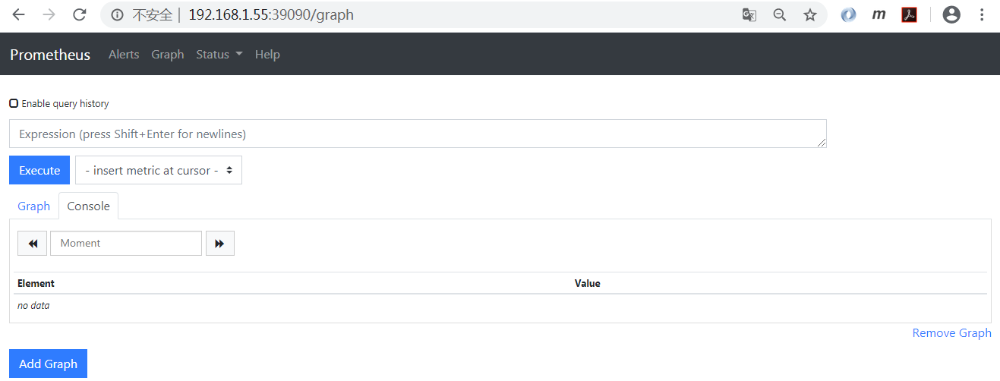

查看Prometheus的targets页面，可以看到所有的targets都可以正常监控。

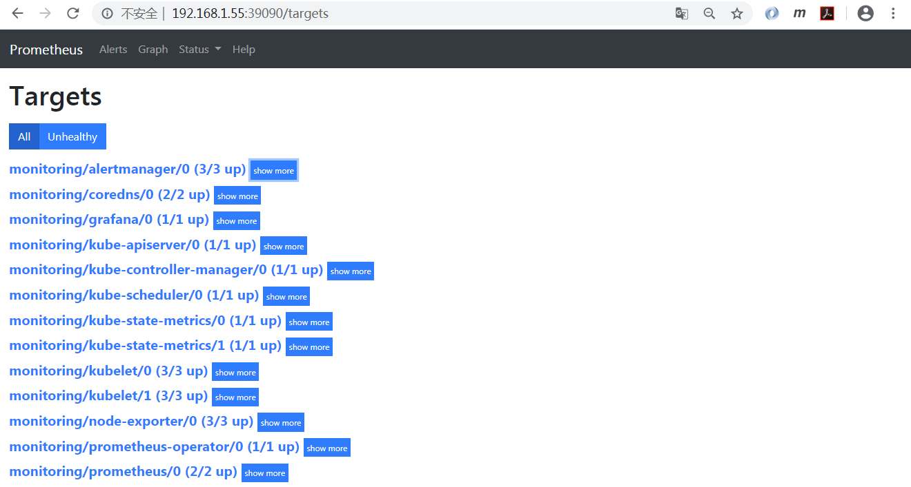

查看Prometheus的alerts页面，可以看到预置了多个告警规则。

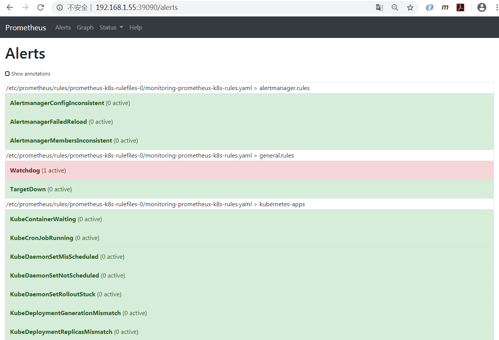

- ### 访问Grafana

地址：[http://192.168.1.55:33000/](http://192.168.1.55:33000/)。

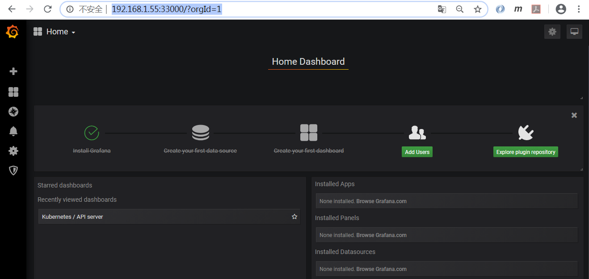

Grafana缺省内置了多个dashboard。

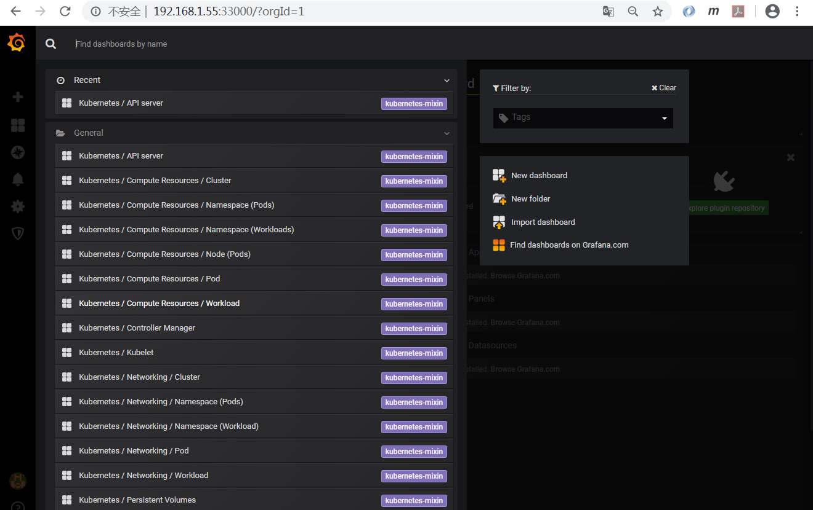

以下为和Node相关的Dashboard，可以看到自动添加了prometheus数据源，可以查看不同Node的监控数据。

以下为和Pod相关的Dashboard，可以查看不同命名空间和Pod的监控数据。

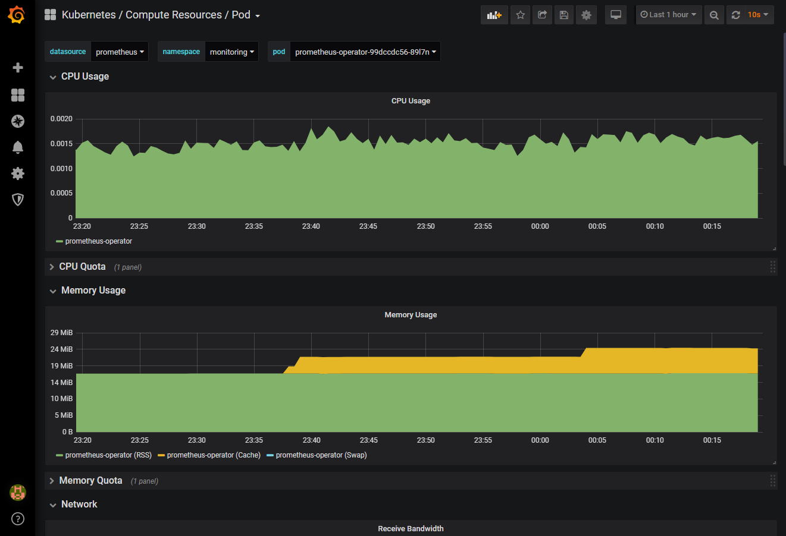

- ### 访问Alertmanager

地址：[http://192.168.1.55:39093/](http://192.168.1.55:39093/)。

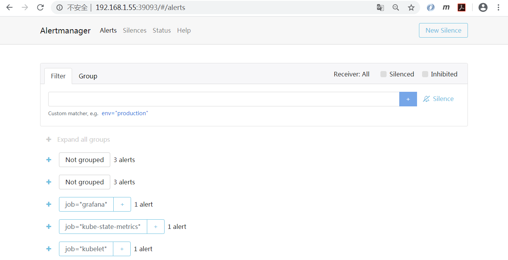

- ### 应用自定义监控-PodMonitor

我们以Nginx Ingress为例,使用Prometheus Operator来监控Nginx Ingress。我们先通过Helm部署，选择nginx/nginx-ingress。

    helm repo add nginx https://helm.nginx.com/stable
    helm search repo nginx
    NAME                                    CHART VERSION   APP VERSION     DESCRIPTION
    bitnami/nginx                           5.1.1           1.16.1          Chart for the nginx server
    bitnami/nginx-ingress-controller        5.2.2           0.26.2          Chart for the nginx Ingress controller
    nginx/nginx-ingress                     0.4.3           1.6.3           NGINX Ingress Controller
    stable/nginx-ingress                    1.27.0          0.26.1          An nginx Ingress controller that uses ConfigMap...
    stable/nginx-ldapauth-proxy             0.1.3           1.13.5          nginx proxy with ldapauth
    stable/nginx-lego                       0.3.1                           Chart for nginx-ingress-controller and kube-lego
    stable/gcloud-endpoints                 0.1.2           1               DEPRECATED Develop, deploy, protect and monitor...

先渲染模板来分析一下，为了集群外访问，"type: LoadBalancer"应该改为"type: NodePort"，并将nodePort配置为固定端口。Pod公开了prometheus端口"containerPort: 9113"，我们下面先使用PodMonitor进行监控。

    helm template gateway nginx/nginx-ingress
    ......
    # Source: nginx-ingress/templates/controller-service.yaml
    apiVersion: v1
    kind: Service
    metadata:
      name: gateway-nginx-ingress
      namespace: default
      labels:
        app.kubernetes.io/name: gateway-nginx-ingress
        helm.sh/chart: nginx-ingress-0.4.3
        app.kubernetes.io/managed-by: Helm
        app.kubernetes.io/instance: gateway
    spec:
      externalTrafficPolicy: Local
      type: LoadBalancer
      ports:
      - port: 80
        targetPort: 80
        protocol: TCP
        name: http
      - port: 443
        targetPort: 443
        protocol: TCP
        name: https
      selector:
        app:  gateway-nginx-ingress
    ---
    # Source: nginx-ingress/templates/controller-deployment.yaml
    apiVersion: apps/v1
    kind: Deployment
    metadata:
      name: gateway-nginx-ingress
      namespace: default
      labels:
        app.kubernetes.io/name: gateway-nginx-ingress
        helm.sh/chart: nginx-ingress-0.4.3
        app.kubernetes.io/managed-by: Helm
        app.kubernetes.io/instance: gateway
    spec:
      replicas: 1
      selector:
        matchLabels:
          app: gateway-nginx-ingress
      template:
        metadata:
          labels:
            app: gateway-nginx-ingress
          annotations:
            prometheus.io/scrape: "true"
            prometheus.io/port: "9113"
        spec:
          serviceAccountName: gateway-nginx-ingress
          hostNetwork: false
          containers:
          - image: "nginx/nginx-ingress:1.6.3"
            name: gateway-nginx-ingress
            imagePullPolicy: "IfNotPresent"
            ports:
            - name: http
              containerPort: 80
            - name: https
              containerPort: 443
            - name: prometheus
              containerPort: 9113
    ......

根据上面的分析，设置以下覆盖参数来安装nginx-ingress。

    helm install gateway nginx/nginx-ingress \
      --set controller.service.type=NodePort \
      --set controller.service.httpPort.nodePort=30080 \
      --set controller.service.httpsPort.nodePort=30443

查看Kubernetes资源。

    NAME                                         READY   STATUS    RESTARTS   AGE
    pod/gateway-nginx-ingress-55886df446-bwbts   1/1     Running   0          12m
    
    NAME                            TYPE        CLUSTER-IP    EXTERNAL-IP   PORT(S)                      AGE
    service/gateway-nginx-ingress   NodePort    10.1.10.126   <none>        80:30080/TCP,443:30443/TCP   12m
    service/kubernetes              ClusterIP   10.1.0.1      <none>        443/TCP                      108d
    
    NAME                                    READY   UP-TO-DATE   AVAILABLE   AGE
    deployment.apps/gateway-nginx-ingress   1/1     1            1           12m
    
    NAME                                               DESIRED   CURRENT   READY   AGE
    replicaset.apps/gateway-nginx-ingress-55886df446   1         1         1       12m

    kubectl get pod -owide
    NAME                                     READY   STATUS    RESTARTS   AGE   IP            NODE        NOMINATED NODE   READINESS GATES
    gateway-nginx-ingress-55886df446-bwbts   1/1     Running   0          13m   10.244.2.46   k8s-node2   <none>           <none>

可以直接从Pod地址访问metrics。

    curl http://10.244.2.46:9113/metrics
    # HELP nginx_ingress_controller_ingress_resources_total Number of handled ingress resources
    # TYPE nginx_ingress_controller_ingress_resources_total gauge
    nginx_ingress_controller_ingress_resources_total{type="master"} 0
    nginx_ingress_controller_ingress_resources_total{type="minion"} 0
    nginx_ingress_controller_ingress_resources_total{type="regular"} 0
    # HELP nginx_ingress_controller_nginx_last_reload_milliseconds Duration in milliseconds of the last NGINX reload
    # TYPE nginx_ingress_controller_nginx_last_reload_milliseconds gauge
    nginx_ingress_controller_nginx_last_reload_milliseconds 195
    # HELP nginx_ingress_controller_nginx_last_reload_status Status of the last NGINX reload
    # TYPE nginx_ingress_controller_nginx_last_reload_status gauge
    nginx_ingress_controller_nginx_last_reload_status 1
    # HELP nginx_ingress_controller_nginx_reload_errors_total Number of unsuccessful NGINX reloads
    # TYPE nginx_ingress_controller_nginx_reload_errors_total counter
    nginx_ingress_controller_nginx_reload_errors_total 0
    # HELP nginx_ingress_controller_nginx_reloads_total Number of successful NGINX reloads
    # TYPE nginx_ingress_controller_nginx_reloads_total counter
    nginx_ingress_controller_nginx_reloads_total 2
    # HELP nginx_ingress_controller_virtualserver_resources_total Number of handled VirtualServer resources
    # TYPE nginx_ingress_controller_virtualserver_resources_total gauge
    nginx_ingress_controller_virtualserver_resources_total 0
    # HELP nginx_ingress_controller_virtualserverroute_resources_total Number of handled VirtualServerRoute resources
    # TYPE nginx_ingress_controller_virtualserverroute_resources_total gauge
    nginx_ingress_controller_virtualserverroute_resources_total 0
    # HELP nginx_ingress_nginx_connections_accepted Accepted client connections
    # TYPE nginx_ingress_nginx_connections_accepted counter
    nginx_ingress_nginx_connections_accepted 6
    ......

我们创建PodMonitor，其中几个需要注意的关键点。
- PodMonitor的name最终会反应到Prometheus的配置中，作为job_name。
- PodMonitor的命名空间必须和Prometheus所在的命名空间相同，此处为monitoring。
- podMetricsEndpoints.interval为抓取间隔。
- podMetricsEndpoints.port需要和Pod/Deployment中的拉取metrics的ports.name对应，此处为prometheus。
- namespaceSelector.matchNames需要和被监控的Pod所在的命名空间相同，此处为default。
- selector.matchLabels的标签必须和被监控的Pod中能唯一标明身份的标签对应。

创建Pod对应的PodMonitor。

    vi prometheus-podMonitorNginxIngress.yaml
    apiVersion: monitoring.coreos.com/v1
    kind: PodMonitor
    metadata:
      labels:
        app: nginx-ingress
      name: nginx-ingress
      namespace: monitoring
    spec:
      podMetricsEndpoints:
      - interval: 15s
        path: /metrics
        port: prometheus
      namespaceSelector:
        matchNames:
        - default
      selector:
        matchLabels:
          app: gateway-nginx-ingress
    
    kubectl apply -f prometheus-podMonitorNginxIngress.yaml

此PodMonitor其实就是一个配置文件，Prometheus Operator会根据PodMonitor进行Prometheus的相关配置，自动对该Pod进行监控。到Prometheus查看监控目标。注意label中有`pod="gateway-nginx-ingress-55886df446-bwbts"`，标明监控Pod。

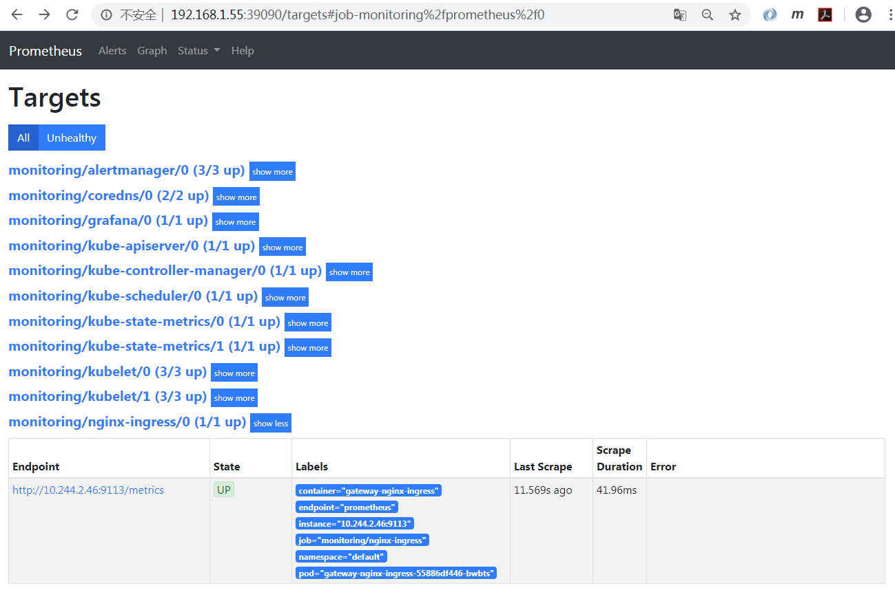

Prometheus已经出现Nginx Ingress相关的配置，job_name: monitoring/nginx-ingress/0。

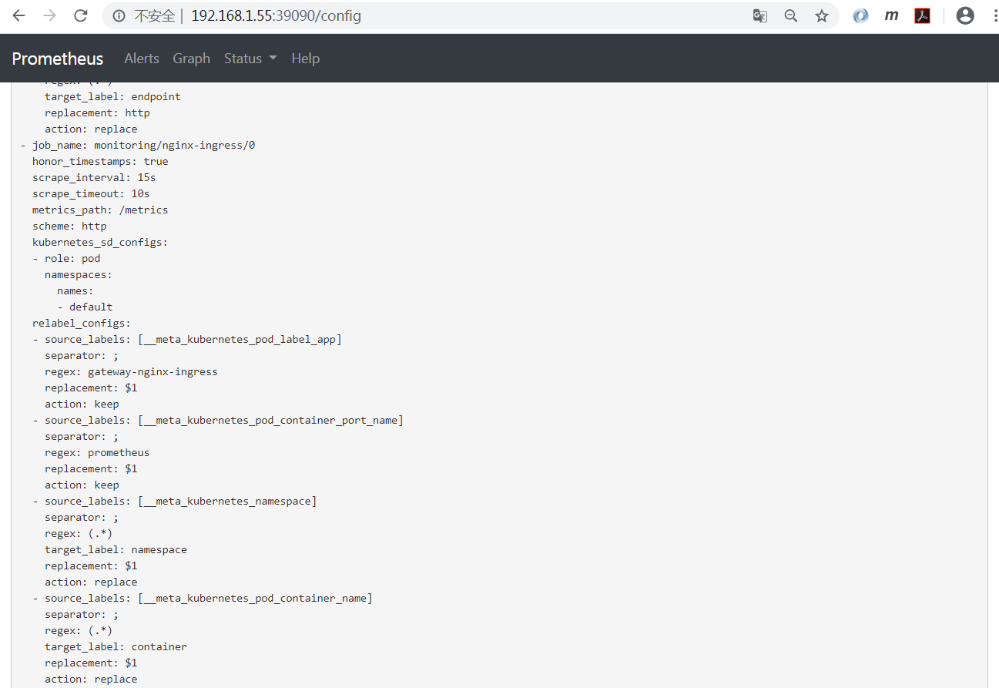

Prometheus监控指标irate(nginx_ingress_nginx_http_requests_total[1m])。

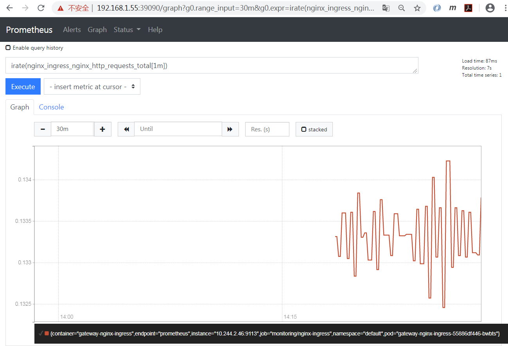

- ### 应用自定义监控-ServiceMonitor

我们仍旧以Nginx Ingress为例,我们先通过Helm部署。

先重新渲染模板来分析一下，Pod公开了prometheus端口"containerPort: 9113"，但Service没有公开该端口。而ServiceMonitor恰恰是是通过Service的prometheus端口拉取metrics数据的，所以我们通过controller.service.customPorts来向Service添加该端口。

    helm template gateway nginx/nginx-ingress \
      --set controller.service.type=NodePort \
      --set controller.service.httpPort.nodePort=30080 \
      --set controller.service.httpsPort.nodePort=30443
    ......
    # Source: nginx-ingress/templates/controller-service.yaml
    apiVersion: v1
    kind: Service
    metadata:
      name: gateway-nginx-ingress
      namespace: default
      labels:
        app.kubernetes.io/name: gateway-nginx-ingress
        helm.sh/chart: nginx-ingress-0.4.3
        app.kubernetes.io/managed-by: Helm
        app.kubernetes.io/instance: gateway
    spec:
      externalTrafficPolicy: Local
      type: NodePort
      ports:
      - port: 80
        targetPort: 80
        protocol: TCP
        name: http
        nodePort: 30080
      - port: 443
        targetPort: 443
        protocol: TCP
        name: https
        nodePort: 30443
      selector:
        app:  gateway-nginx-ingress
    ---
    # Source: nginx-ingress/templates/controller-deployment.yaml
    apiVersion: apps/v1
    kind: Deployment
    metadata:
      name: gateway-nginx-ingress
      namespace: default
      labels:
        app.kubernetes.io/name: gateway-nginx-ingress
        helm.sh/chart: nginx-ingress-0.4.3
        app.kubernetes.io/managed-by: Helm
        app.kubernetes.io/instance: gateway
    spec:
      replicas: 1
      selector:
        matchLabels:
          app: gateway-nginx-ingress
      template:
        metadata:
          labels:
            app: gateway-nginx-ingress
          annotations:
            prometheus.io/scrape: "true"
            prometheus.io/port: "9113"
        spec:
          serviceAccountName: gateway-nginx-ingress
          hostNetwork: false
          containers:
          - image: "nginx/nginx-ingress:1.6.3"
            name: gateway-nginx-ingress
            imagePullPolicy: "IfNotPresent"
            ports:
            - name: http
              containerPort: 80
            - name: https
              containerPort: 443
            - name: prometheus
              containerPort: 9113
    ......

根据上面的分析，设置以下覆盖参数来安装nginx-ingress。

    helm install gateway nginx/nginx-ingress \
      --set controller.service.type=NodePort \
      --set controller.service.httpPort.nodePort=30080 \
      --set controller.service.httpsPort.nodePort=30443 \
      --set controller.service.customPorts[0].port=9113 \
      --set controller.service.customPorts[0].targetPort=9113 \
      --set controller.service.customPorts[0].protocol=TCP \
      --set controller.service.customPorts[0].name=prometheus \
      --set controller.service.customPorts[0].nodePort=39113

查看Kubernetes资源，可以看出service/gateway-nginx-ingress暴露了9113端口。

    kubectl get all
    NAME                                         READY   STATUS    RESTARTS   AGE
    pod/gateway-nginx-ingress-55886df446-mwjs8   1/1     Running   0          10s
    
    NAME                            TYPE        CLUSTER-IP    EXTERNAL-IP   PORT(S)                                     AGE
    service/gateway-nginx-ingress   NodePort    10.1.98.109   <none>        9113:39113/TCP,80:30080/TCP,443:30443/TCP   10s
    service/kubernetes              ClusterIP   10.1.0.1      <none>        443/TCP                                     107d
    
    NAME                                    READY   UP-TO-DATE   AVAILABLE   AGE
    deployment.apps/gateway-nginx-ingress   1/1     1            1           10s
    
    NAME                                               DESIRED   CURRENT   READY   AGE
    replicaset.apps/gateway-nginx-ingress-55886df446   1         1         1       10s

可以访问metrics。

    curl http://192.168.1.55:39113/metrics
    # HELP nginx_ingress_controller_ingress_resources_total Number of handled ingress resources
    # TYPE nginx_ingress_controller_ingress_resources_total gauge
    nginx_ingress_controller_ingress_resources_total{type="master"} 0
    nginx_ingress_controller_ingress_resources_total{type="minion"} 0
    nginx_ingress_controller_ingress_resources_total{type="regular"} 0
    # HELP nginx_ingress_controller_nginx_last_reload_milliseconds Duration in milliseconds of the last NGINX reload
    # TYPE nginx_ingress_controller_nginx_last_reload_milliseconds gauge
    nginx_ingress_controller_nginx_last_reload_milliseconds 152
    # HELP nginx_ingress_controller_nginx_last_reload_status Status of the last NGINX reload
    # TYPE nginx_ingress_controller_nginx_last_reload_status gauge
    nginx_ingress_controller_nginx_last_reload_status 1
    # HELP nginx_ingress_controller_nginx_reload_errors_total Number of unsuccessful NGINX reloads
    # TYPE nginx_ingress_controller_nginx_reload_errors_total counter
    nginx_ingress_controller_nginx_reload_errors_total 0
    # HELP nginx_ingress_controller_nginx_reloads_total Number of successful NGINX reloads
    # TYPE nginx_ingress_controller_nginx_reloads_total counter
    nginx_ingress_controller_nginx_reloads_total 2
    # HELP nginx_ingress_controller_virtualserver_resources_total Number of handled VirtualServer resources
    # TYPE nginx_ingress_controller_virtualserver_resources_total gauge
    nginx_ingress_controller_virtualserver_resources_total 0
    # HELP nginx_ingress_controller_virtualserverroute_resources_total Number of handled VirtualServerRoute resources
    # TYPE nginx_ingress_controller_virtualserverroute_resources_total gauge
    nginx_ingress_controller_virtualserverroute_resources_total 0
    # HELP nginx_ingress_nginx_connections_accepted Accepted client connections
    # TYPE nginx_ingress_nginx_connections_accepted counter
    nginx_ingress_nginx_connections_accepted 5
    ......

查看Prometheus自定义资源，Prometheus根据serviceMonitorSelector关联ServiceMonitor，如果serviceMonitorSelector没有定义，那意味着会关联所有的ServiceMonitor。

    kubectl get prometheuses.monitoring.coreos.com/k8s -nmonitoring -oyaml
    apiVersion: monitoring.coreos.com/v1
    kind: Prometheus
    metadata:
      annotations:
        kubectl.kubernetes.io/last-applied-configuration: |
          {"apiVersion":"monitoring.coreos.com/v1","kind":"Prometheus","metadata":{"annotations":{},"labels":{"prometheus":"k8s"},"name":"k8s","namespace":"monitoring"},"spec":{"alerting":{"alertmanagers":[{"name":"alertmanager-main","namespace":"monitoring","port":"web"}]},"baseImage":"quay.io/prometheus/prometheus","nodeSelector":{"kubernetes.io/os":"linux"},"podMonitorSelector":{},"replicas":2,"resources":{"requests":{"memory":"400Mi"}},"ruleSelector":{"matchLabels":{"prometheus":"k8s","role":"alert-rules"}},"securityContext":{"fsGroup":2000,"runAsNonRoot":true,"runAsUser":1000},"serviceAccountName":"prometheus-k8s","serviceMonitorNamespaceSelector":{},"serviceMonitorSelector":{},"version":"v2.11.0"}}
      creationTimestamp: "2020-03-26T13:09:35Z"
      generation: 1
      labels:
        prometheus: k8s
      name: k8s
      namespace: monitoring
      resourceVersion: "15195"
      selfLink: /apis/monitoring.coreos.com/v1/namespaces/monitoring/prometheuses/k8s
      uid: 802c8f09-95e8-43e8-a2ea-131877fc6b4e
    spec:
      alerting:
        alertmanagers:
        - name: alertmanager-main
          namespace: monitoring
          port: web
      baseImage: quay.io/prometheus/prometheus
      nodeSelector:
        kubernetes.io/os: linux
      podMonitorSelector: {}
      replicas: 2
      resources:
        requests:
          memory: 400Mi
      ruleSelector:
        matchLabels:
          prometheus: k8s
          role: alert-rules
      securityContext:
        fsGroup: 2000
        runAsNonRoot: true
        runAsUser: 1000
      serviceAccountName: prometheus-k8s
      serviceMonitorNamespaceSelector: {}
      serviceMonitorSelector: {}
      version: v2.11.0

创建ServiceMonitor。其中几个需要注意的关键点。
- ServiceMonitor的name最终会反应到Prometheus的配置中，作为job_name。
- 如果Prometheus自定义资源中定义了serviceMonitorSelector，ServiceMonitor就需要有对应的标签，由此上面的Prometheus自定义资源没有定义serviceMonitorSelector，所以此处没有要求。
- ServiceMonitor的命名空间必须和Prometheus所在的命名空间相同，此处为monitoring。
- endpoints.interval为抓取间隔。
- endpoints.port需要和Service中的拉取metrics的ports.name对应，此处为prometheus。
- namespaceSelector.matchNames需要和被监控的Service所在的命名空间相同，此处为default。
- selector.matchLabels的标签必须和被监控的Service中能唯一标明身份的标签对应。

创建nginx-ingress服务对应的ServiceMonitor。

    vi prometheus-serviceMonitorNginxIngress.yaml
    apiVersion: monitoring.coreos.com/v1
    kind: ServiceMonitor
    metadata:
      labels:
        app: nginx-ingress
      name: nginx-ingress
      namespace: monitoring
    spec:
      endpoints:
      - interval: 15s
        port: prometheus
      namespaceSelector:
        matchNames:
        - default
      selector:
        matchLabels:
          app.kubernetes.io/name: gateway-nginx-ingress
    
    kubectl apply -f prometheus-serviceMonitorNginxIngress.yaml

此ServiceMonitor其实就是一个配置文件，Prometheus Operator会根据ServiceMonitor进行Prometheus的相关配置，自动对该服务进行监控。到Prometheus查看监控目标。注意此处有`service="gateway-nginx-ingress"`标明是对服务的监控。

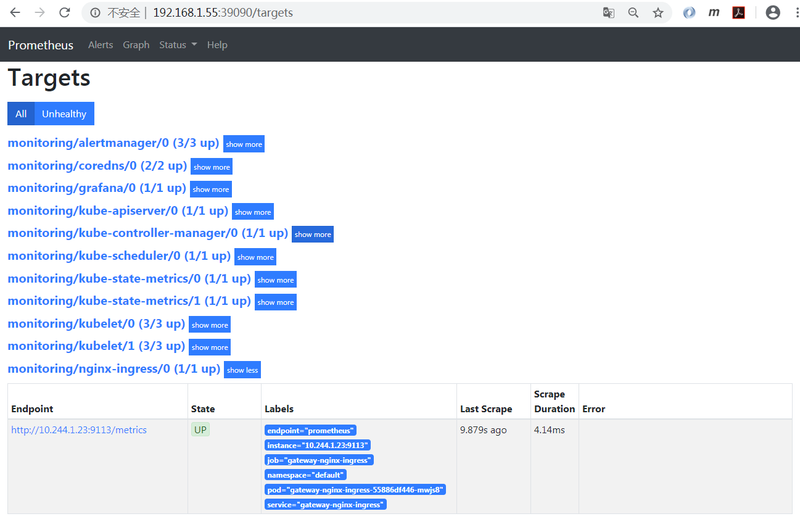

Prometheus已经出现Nginx Ingress相关的配置，`job_name: monitoring/nginx-ingress/0`。

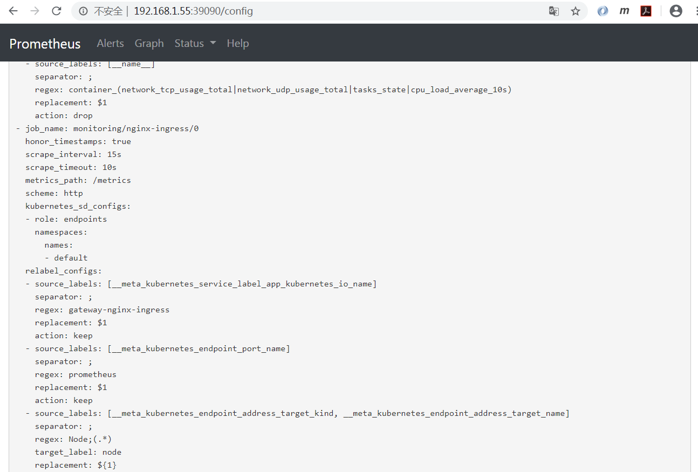

Prometheus监控指标`irate(nginx_ingress_nginx_http_requests_total[1m])`。

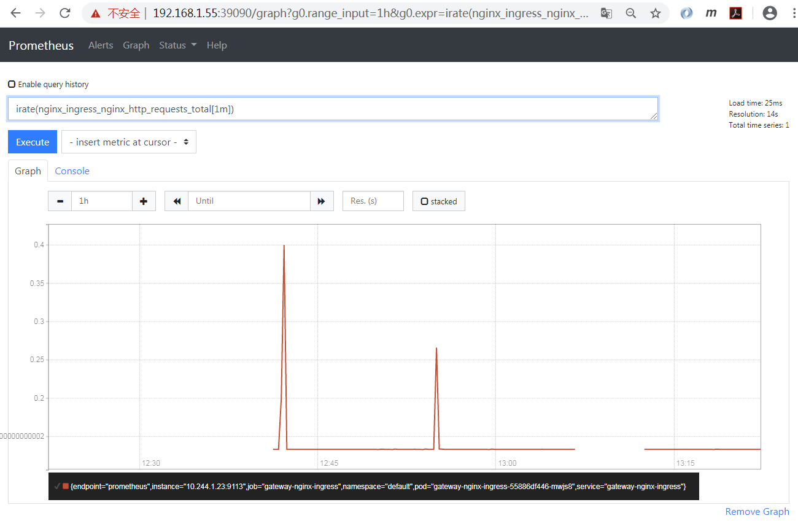
