# Prometheus Operator部署和自定义监控

- ### 说明

Prometheus-Operator官方提供的架构图：

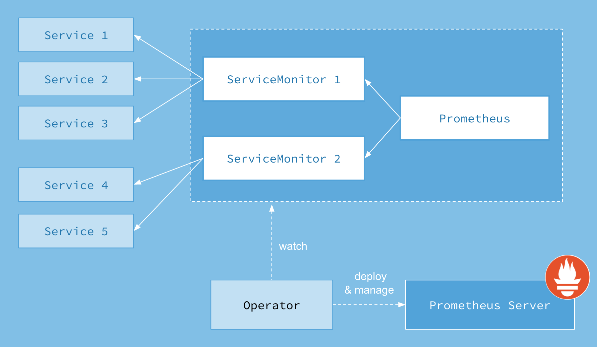

Operator是最核心的部分，作为一个控制器，他会去创建Prometheus、PodMonitor、ServiceMonitor、AlertManager以及PrometheusRule这5个CRD资源对象，然后会一直监控并维持这5个资源对象的状态。

其中创建的Prometheus这种资源对象就是作为Prometheus Server存在，而PodMonitor和ServiceMonitor就是exporter的各种抽象，是用来提供专门提供metrics数据接口的工具，Prometheus就是通过PodMonitor和ServiceMonitor提供的metrics数据接口去pull数据的，当然alertmanager这种资源对象就是对应的AlertManager的抽象，而PrometheusRule是用来被Prometheus实例使用的报警规则文件。

这样我们要在集群中监控什么数据，就变成了直接去操作 Kubernetes 集群的资源对象了，是不是方便很多了。上图中的 Service 和 ServiceMonitor 都是 Kubernetes 的资源，一个 ServiceMonitor 可以通过 labelSelector 的方式去匹配一类 Service，Prometheus 也可以通过 labelSelector 去匹配多个ServiceMonitor。

- ### 安装

下载[https://github.com/coreos/kube-prometheus](https://github.com/coreos/kube-prometheus)，最好下载最新的Release版本。本文下载[https://github.com/coreos/kube-prometheus/archive/v0.3.0.tar.gz](https://github.com/coreos/kube-prometheus/archive/v0.3.0.tar.gz)。

    mkdir prometheus
    cd prometheus/

上传kube-prometheus-0.3.0.tar.gz，开始安装。

    tar zxvf kube-prometheus-0.3.0.tar.gz
    
    cd kube-prometheus-0.3.0/manifests/setup/

    kubectl apply -f .
    namespace/monitoring created
    customresourcedefinition.apiextensions.k8s.io/alertmanagers.monitoring.coreos.com created
    customresourcedefinition.apiextensions.k8s.io/podmonitors.monitoring.coreos.com created
    customresourcedefinition.apiextensions.k8s.io/prometheuses.monitoring.coreos.com created
    customresourcedefinition.apiextensions.k8s.io/prometheusrules.monitoring.coreos.com created
    customresourcedefinition.apiextensions.k8s.io/servicemonitors.monitoring.coreos.com created
    clusterrole.rbac.authorization.k8s.io/prometheus-operator created
    clusterrolebinding.rbac.authorization.k8s.io/prometheus-operator created
    deployment.apps/prometheus-operator created
    service/prometheus-operator created
    serviceaccount/prometheus-operator created

查看创建的CRDs。

    kubectl get crd | grep coreos
    alertmanagers.monitoring.coreos.com     2020-03-26T12:27:08Z
    podmonitors.monitoring.coreos.com       2020-03-26T12:27:08Z
    prometheuses.monitoring.coreos.com      2020-03-26T12:27:09Z
    prometheusrules.monitoring.coreos.com   2020-03-26T12:27:10Z
    servicemonitors.monitoring.coreos.com   2020-03-26T12:27:11Z

默认情况下，`prometheus-serviceMonitorKubelet.yaml`关联的kubelet的https-metrics（10250）端口拉取metrics数据，为了安全起见，kubelet关闭了匿名认证并开启了webhook授权，访问https-metrics端口需要认证和授权。http-metrics(10255)为只读端口，无须认证和授权。但默认情况下是不打开的，可以如下配置打开该端口。注意所有安装了kubelet服务的集群主机都需要配置。

    vi /var/lib/kubelet/config.yaml
    readOnlyPort: 10255
    
    systemctl restart kubelet

然后将prometheus-serviceMonitorKubelet.yaml文件中的https-metrics更改成http-metrics即可。

    cd ..
    vi prometheus-serviceMonitorKubelet.yaml
        port: https-metrics
        scheme: https
    #改为
        port: http-metrics
        scheme: http

为了Kubernetes集群外访问prometheus、grafana和alertmanager，可以配置NodePort或者Ingress，此处简单起见，直接修改为NodePort。

    vi prometheus-service.yaml
      type: NodePort
        nodePort: 39090

    vi grafana-service.yaml
      type: NodePort
        nodePort: 33000

    vi alertmanager-service.yaml
      type: NodePort
        nodePort: 39093

`prometheus-serviceMonitorKubeScheduler.yaml`定义了监控kube-scheduler的ServiceMonitor。serviceMonitorKubeScheduler通过`k8s-app=kube-scheduler`和kube-scheduler服务关联，但Kubernetes缺省没有创建该service。可以先看一下对应的kube-scheduler-k8s-master这个pod，然后直接在manifests目录下定义kube-scheduler服务，下面统一部署。10251是kube-scheduler服务metrics数据所在的端口。

> kube-scheduler：调度器主要负责为新创建的pod在集群中寻找最合适的node，并将pod调度到Node上。

    kubectl get pod kube-scheduler-k8s-master -nkube-system --show-labels
    NAME                        READY   STATUS    RESTARTS   AGE    LABELS
    kube-scheduler-k8s-master   1/1     Running   4          103d   component=kube-scheduler,tier=control-plane
    
    vi prometheus-kubeSchedulerService.yaml
    apiVersion: v1
    kind: Service
    metadata:
      namespace: kube-system
      name: kube-scheduler
      labels:
        k8s-app: kube-scheduler
    spec:
      selector:
        component: kube-scheduler
      ports:
      - name: http-metrics
        port: 10251
        targetPort: 10251
        protocol: TCP

同样，`prometheus-serviceMonitorKubeControllerManager.yaml`定义了监控kube-controller-manager的ServiceMonitor。serviceMonitorKubeControllerManager通过`k8s-app: kube-controller-manager`和kube-controller-manager服务关联，但Kubernetes缺省没有创建该service。可以先看一下对应的kube-controller-manager-k8s-master这个pod，然后直接在manifests目录下定义kube-controller-manager服务。10252是kube-controller-manager服务metrics数据所在的端口。

> kube-controller-manager：管理控制中心负责集群内的Node、Pod副本、服务端点（Endpoint）、命名空间（Namespace）、服务账号（ServiceAccount）、资源定额（ResourceQuota）的管理，当某个Node意外宕机时，Controller Manager会及时发现并执行自动化修复流程，确保集群始终处于预期的工作状态。

    kubectl get pod kube-controller-manager-k8s-master -nkube-system --show-labels
    NAME                                 READY   STATUS    RESTARTS   AGE    LABELS
    kube-controller-manager-k8s-master   1/1     Running   4          103d   component=kube-controller-manager,tier=control-plane
    
    vi prometheus-kubeControllerManagerService.yaml
    apiVersion: v1
    kind: Service
    metadata:
      namespace: kube-system
      name: kube-controller-manager
      labels:
        k8s-app: kube-controller-manager
    spec:
      selector:
        component: kube-controller-manager
      ports:
      - name: http-metrics
        port: 10252
        targetPort: 10252
        protocol: TCP

继续安装。

    kubectl apply -f .
    alertmanager.monitoring.coreos.com/main created
    secret/alertmanager-main created
    service/alertmanager-main created
    serviceaccount/alertmanager-main created
    servicemonitor.monitoring.coreos.com/alertmanager created
    secret/grafana-datasources created
    configmap/grafana-dashboard-apiserver created
    configmap/grafana-dashboard-cluster-total created
    configmap/grafana-dashboard-controller-manager created
    configmap/grafana-dashboard-k8s-resources-cluster created
    configmap/grafana-dashboard-k8s-resources-namespace created
    configmap/grafana-dashboard-k8s-resources-node created
    configmap/grafana-dashboard-k8s-resources-pod created
    configmap/grafana-dashboard-k8s-resources-workload created
    configmap/grafana-dashboard-k8s-resources-workloads-namespace created
    configmap/grafana-dashboard-kubelet created
    configmap/grafana-dashboard-namespace-by-pod created
    configmap/grafana-dashboard-namespace-by-workload created
    configmap/grafana-dashboard-node-cluster-rsrc-use created
    configmap/grafana-dashboard-node-rsrc-use created
    configmap/grafana-dashboard-nodes created
    configmap/grafana-dashboard-persistentvolumesusage created
    configmap/grafana-dashboard-pod-total created
    configmap/grafana-dashboard-pods created
    configmap/grafana-dashboard-prometheus-remote-write created
    configmap/grafana-dashboard-prometheus created
    configmap/grafana-dashboard-proxy created
    configmap/grafana-dashboard-scheduler created
    configmap/grafana-dashboard-statefulset created
    configmap/grafana-dashboard-workload-total created
    configmap/grafana-dashboards created
    deployment.apps/grafana created
    service/grafana created
    serviceaccount/grafana created
    servicemonitor.monitoring.coreos.com/grafana created
    clusterrole.rbac.authorization.k8s.io/kube-state-metrics created
    clusterrolebinding.rbac.authorization.k8s.io/kube-state-metrics created
    deployment.apps/kube-state-metrics created
    role.rbac.authorization.k8s.io/kube-state-metrics created
    rolebinding.rbac.authorization.k8s.io/kube-state-metrics created
    service/kube-state-metrics created
    serviceaccount/kube-state-metrics created
    servicemonitor.monitoring.coreos.com/kube-state-metrics created
    clusterrole.rbac.authorization.k8s.io/node-exporter created
    clusterrolebinding.rbac.authorization.k8s.io/node-exporter created
    daemonset.apps/node-exporter created
    service/node-exporter created
    serviceaccount/node-exporter created
    servicemonitor.monitoring.coreos.com/node-exporter created
    apiservice.apiregistration.k8s.io/v1beta1.metrics.k8s.io created
    clusterrole.rbac.authorization.k8s.io/prometheus-adapter created
    clusterrole.rbac.authorization.k8s.io/system:aggregated-metrics-reader created
    clusterrolebinding.rbac.authorization.k8s.io/prometheus-adapter created
    clusterrolebinding.rbac.authorization.k8s.io/resource-metrics:system:auth-delegator created
    clusterrole.rbac.authorization.k8s.io/resource-metrics-server-resources created
    configmap/adapter-config created
    deployment.apps/prometheus-adapter created
    rolebinding.rbac.authorization.k8s.io/resource-metrics-auth-reader created
    service/prometheus-adapter created
    serviceaccount/prometheus-adapter created
    clusterrole.rbac.authorization.k8s.io/prometheus-k8s created
    clusterrolebinding.rbac.authorization.k8s.io/prometheus-k8s created
    servicemonitor.monitoring.coreos.com/prometheus-operator created
    prometheus.monitoring.coreos.com/k8s created
    rolebinding.rbac.authorization.k8s.io/prometheus-k8s-config created
    rolebinding.rbac.authorization.k8s.io/prometheus-k8s created
    rolebinding.rbac.authorization.k8s.io/prometheus-k8s created
    rolebinding.rbac.authorization.k8s.io/prometheus-k8s created
    role.rbac.authorization.k8s.io/prometheus-k8s-config created
    role.rbac.authorization.k8s.io/prometheus-k8s created
    role.rbac.authorization.k8s.io/prometheus-k8s created
    role.rbac.authorization.k8s.io/prometheus-k8s created
    prometheusrule.monitoring.coreos.com/prometheus-k8s-rules created
    service/prometheus-k8s created
    serviceaccount/prometheus-k8s created
    servicemonitor.monitoring.coreos.com/prometheus created
    servicemonitor.monitoring.coreos.com/kube-apiserver created
    servicemonitor.monitoring.coreos.com/coredns created
    servicemonitor.monitoring.coreos.com/kube-controller-manager created
    servicemonitor.monitoring.coreos.com/kube-scheduler created
    servicemonitor.monitoring.coreos.com/kubelet created
    service/kube-controller-manager created
    service/kube-scheduler created

查看Kubernetes资源，可以看出prometheus-k8s和alertmanager-main的控制器类型为statefulset，

    kubectl get all -nmonitoring
    NAME                                      READY   STATUS    RESTARTS   AGE
    pod/alertmanager-main-0                   2/2     Running   4          12h
    pod/alertmanager-main-1                   2/2     Running   0          12h
    pod/alertmanager-main-2                   2/2     Running   6          12h
    pod/grafana-58dc7468d7-d8bmt              1/1     Running   0          12h
    pod/kube-state-metrics-78b46c84d8-wsvrb   3/3     Running   0          12h
    pod/node-exporter-6m4kd                   2/2     Running   0          12h
    pod/node-exporter-bhxw2                   2/2     Running   6          12h
    pod/node-exporter-tkvq5                   2/2     Running   0          12h
    pod/prometheus-adapter-5cd5798d96-5ffb5   1/1     Running   0          12h
    pod/prometheus-k8s-0                      3/3     Running   10         12h
    pod/prometheus-k8s-1                      3/3     Running   1          12h
    pod/prometheus-operator-99dccdc56-89l7n   1/1     Running   0          12h
    
    NAME                            TYPE        CLUSTER-IP     EXTERNAL-IP   PORT(S)                      AGE
    service/alertmanager-main       NodePort    10.1.96.0      <none>        9093:39093/TCP               12h
    service/alertmanager-operated   ClusterIP   None           <none>        9093/TCP,9094/TCP,9094/UDP   12h
    service/grafana                 NodePort    10.1.165.84    <none>        3000:33000/TCP               12h
    service/kube-state-metrics      ClusterIP   None           <none>        8443/TCP,9443/TCP            12h
    service/node-exporter           ClusterIP   None           <none>        9100/TCP                     12h
    service/prometheus-adapter      ClusterIP   10.1.114.161   <none>        443/TCP                      12h
    service/prometheus-k8s          NodePort    10.1.162.187   <none>        9090:39090/TCP               12h
    service/prometheus-operated     ClusterIP   None           <none>        9090/TCP                     12h
    service/prometheus-operator     ClusterIP   None           <none>        8080/TCP                     12h
    
    NAME                           DESIRED   CURRENT   READY   UP-TO-DATE   AVAILABLE   NODE SELECTOR            AGE
    daemonset.apps/node-exporter   3         3         3       3            3           kubernetes.io/os=linux   12h
    
    NAME                                  READY   UP-TO-DATE   AVAILABLE   AGE
    deployment.apps/grafana               1/1     1            1           12h
    deployment.apps/kube-state-metrics    1/1     1            1           12h
    deployment.apps/prometheus-adapter    1/1     1            1           12h
    deployment.apps/prometheus-operator   1/1     1            1           12h
    
    NAME                                            DESIRED   CURRENT   READY   AGE
    replicaset.apps/grafana-58dc7468d7              1         1         1       12h
    replicaset.apps/kube-state-metrics-78b46c84d8   1         1         1       12h
    replicaset.apps/prometheus-adapter-5cd5798d96   1         1         1       12h
    replicaset.apps/prometheus-operator-99dccdc56   1         1         1       12h
    
    NAME                                 READY   AGE
    statefulset.apps/alertmanager-main   3/3     12h
    statefulset.apps/prometheus-k8s      2/2     12h

- ### 访问Prometheus

地址：[http://192.168.1.55:39090/](http://192.168.1.55:39090/)。

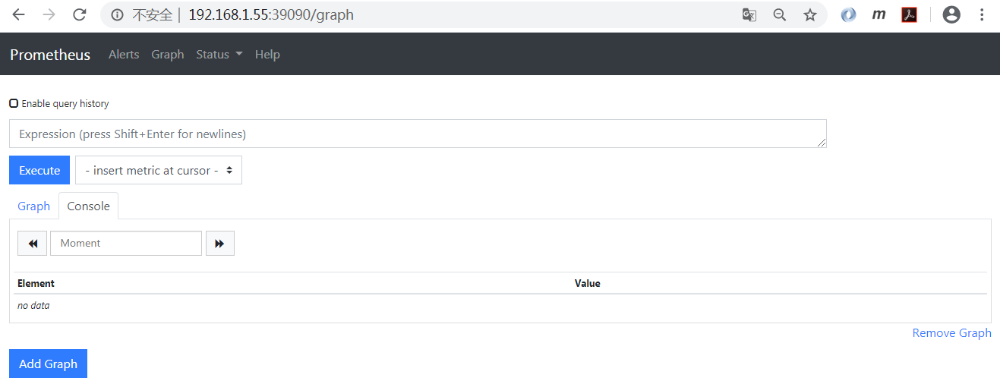

查看Prometheus的targets页面，可以看到所有的targets都可以正常监控。

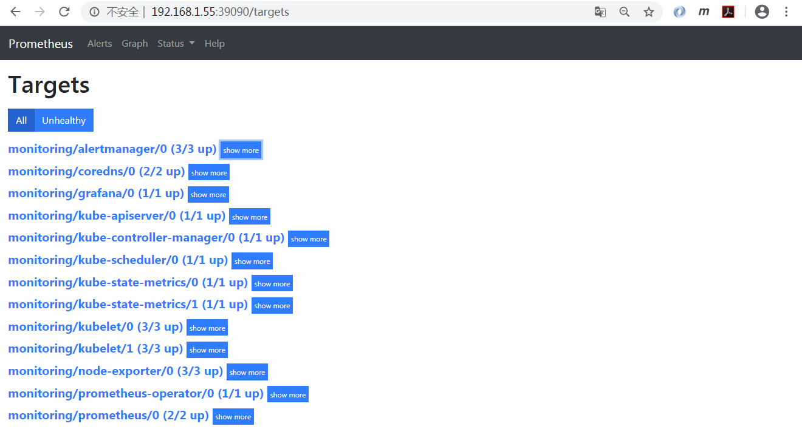

查看Prometheus的alerts页面，可以看到预置了多个告警规则。

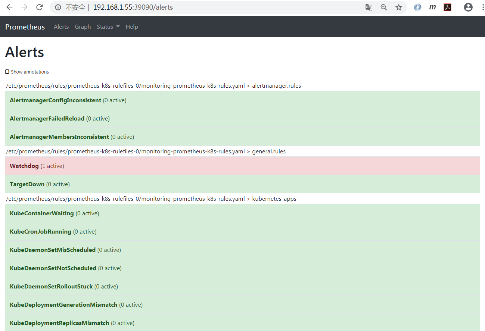

- ### 访问Grafana

地址：[http://192.168.1.55:33000/](http://192.168.1.55:33000/)。

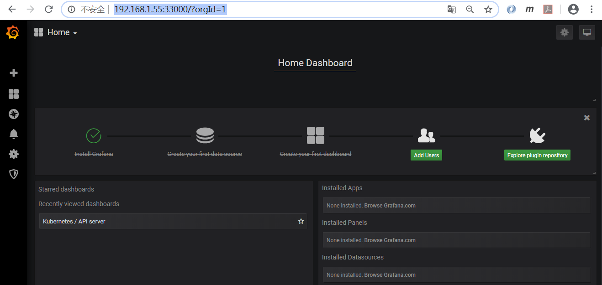

Grafana缺省内置了多个dashboard。

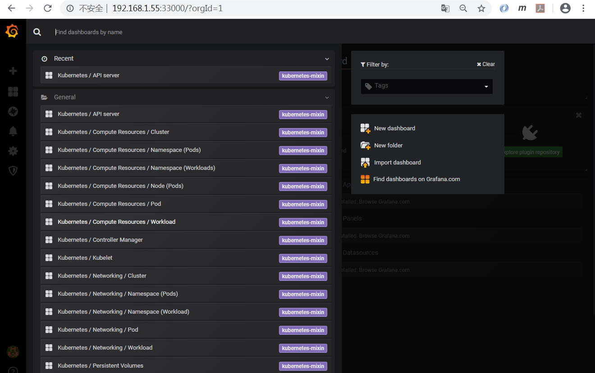

以下为和Node相关的Dashboard，可以看到自动添加了prometheus数据源，可以查看不同Node的监控数据。

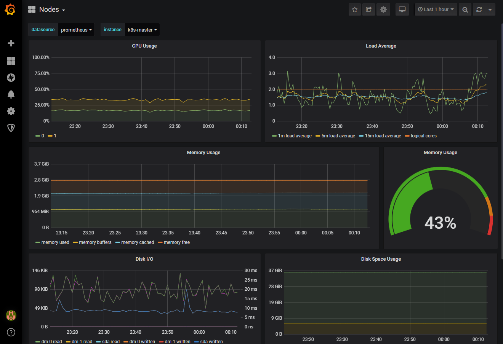

以下为和Pod相关的Dashboard，可以查看不同命名空间和Pod的监控数据。

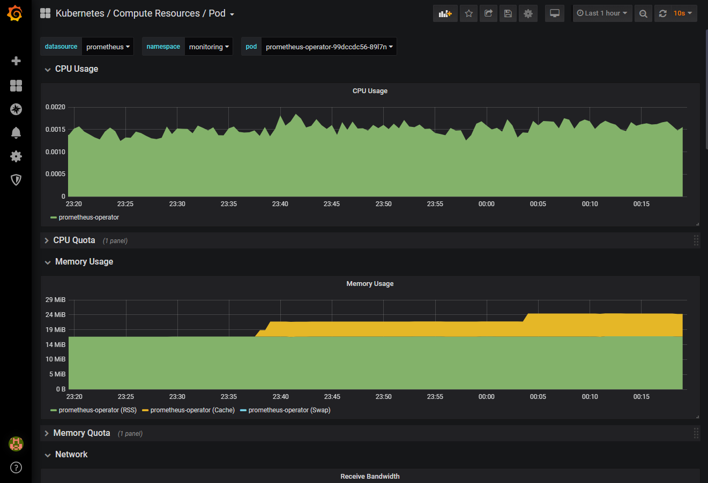

- ### 访问Alertmanager

地址：[http://192.168.1.55:39093/](http://192.168.1.55:39093/)。

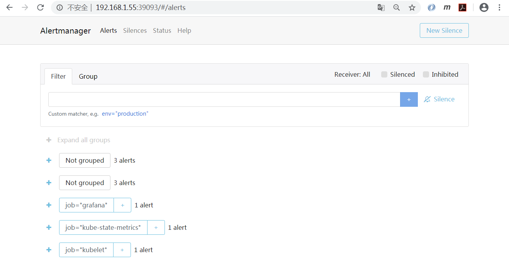

- ### 应用自定义监控-PodMonitor

我们以Nginx Ingress为例,使用Prometheus Operator来监控Nginx Ingress。我们先通过Helm部署，选择nginx/nginx-ingress。

    helm repo add nginx https://helm.nginx.com/stable
    helm search repo nginx
    NAME                                    CHART VERSION   APP VERSION     DESCRIPTION
    bitnami/nginx                           5.1.1           1.16.1          Chart for the nginx server
    bitnami/nginx-ingress-controller        5.2.2           0.26.2          Chart for the nginx Ingress controller
    nginx/nginx-ingress                     0.4.3           1.6.3           NGINX Ingress Controller
    stable/nginx-ingress                    1.27.0          0.26.1          An nginx Ingress controller that uses ConfigMap...
    stable/nginx-ldapauth-proxy             0.1.3           1.13.5          nginx proxy with ldapauth
    stable/nginx-lego                       0.3.1                           Chart for nginx-ingress-controller and kube-lego
    stable/gcloud-endpoints                 0.1.2           1               DEPRECATED Develop, deploy, protect and monitor...

先渲染模板来分析一下，为了集群外访问，"type: LoadBalancer"应该改为"type: NodePort"，并将nodePort配置为固定端口。Pod公开了prometheus端口"containerPort: 9113"，我们下面先使用PodMonitor进行监控。

    helm template gateway nginx/nginx-ingress
    ......
    # Source: nginx-ingress/templates/controller-service.yaml
    apiVersion: v1
    kind: Service
    metadata:
      name: gateway-nginx-ingress
      namespace: default
      labels:
        app.kubernetes.io/name: gateway-nginx-ingress
        helm.sh/chart: nginx-ingress-0.4.3
        app.kubernetes.io/managed-by: Helm
        app.kubernetes.io/instance: gateway
    spec:
      externalTrafficPolicy: Local
      type: LoadBalancer
      ports:
      - port: 80
        targetPort: 80
        protocol: TCP
        name: http
      - port: 443
        targetPort: 443
        protocol: TCP
        name: https
      selector:
        app:  gateway-nginx-ingress
    ---
    # Source: nginx-ingress/templates/controller-deployment.yaml
    apiVersion: apps/v1
    kind: Deployment
    metadata:
      name: gateway-nginx-ingress
      namespace: default
      labels:
        app.kubernetes.io/name: gateway-nginx-ingress
        helm.sh/chart: nginx-ingress-0.4.3
        app.kubernetes.io/managed-by: Helm
        app.kubernetes.io/instance: gateway
    spec:
      replicas: 1
      selector:
        matchLabels:
          app: gateway-nginx-ingress
      template:
        metadata:
          labels:
            app: gateway-nginx-ingress
          annotations:
            prometheus.io/scrape: "true"
            prometheus.io/port: "9113"
        spec:
          serviceAccountName: gateway-nginx-ingress
          hostNetwork: false
          containers:
          - image: "nginx/nginx-ingress:1.6.3"
            name: gateway-nginx-ingress
            imagePullPolicy: "IfNotPresent"
            ports:
            - name: http
              containerPort: 80
            - name: https
              containerPort: 443
            - name: prometheus
              containerPort: 9113
    ......

根据上面的分析，设置以下覆盖参数来安装nginx-ingress。

    helm install gateway nginx/nginx-ingress \
      --set controller.service.type=NodePort \
      --set controller.service.httpPort.nodePort=30080 \
      --set controller.service.httpsPort.nodePort=30443

查看Kubernetes资源。

    NAME                                         READY   STATUS    RESTARTS   AGE
    pod/gateway-nginx-ingress-55886df446-bwbts   1/1     Running   0          12m
    
    NAME                            TYPE        CLUSTER-IP    EXTERNAL-IP   PORT(S)                      AGE
    service/gateway-nginx-ingress   NodePort    10.1.10.126   <none>        80:30080/TCP,443:30443/TCP   12m
    service/kubernetes              ClusterIP   10.1.0.1      <none>        443/TCP                      108d
    
    NAME                                    READY   UP-TO-DATE   AVAILABLE   AGE
    deployment.apps/gateway-nginx-ingress   1/1     1            1           12m
    
    NAME                                               DESIRED   CURRENT   READY   AGE
    replicaset.apps/gateway-nginx-ingress-55886df446   1         1         1       12m

    kubectl get pod -owide
    NAME                                     READY   STATUS    RESTARTS   AGE   IP            NODE        NOMINATED NODE   READINESS GATES
    gateway-nginx-ingress-55886df446-bwbts   1/1     Running   0          13m   10.244.2.46   k8s-node2   <none>           <none>

可以直接从Pod地址访问metrics。

    curl http://10.244.2.46:9113/metrics
    # HELP nginx_ingress_controller_ingress_resources_total Number of handled ingress resources
    # TYPE nginx_ingress_controller_ingress_resources_total gauge
    nginx_ingress_controller_ingress_resources_total{type="master"} 0
    nginx_ingress_controller_ingress_resources_total{type="minion"} 0
    nginx_ingress_controller_ingress_resources_total{type="regular"} 0
    # HELP nginx_ingress_controller_nginx_last_reload_milliseconds Duration in milliseconds of the last NGINX reload
    # TYPE nginx_ingress_controller_nginx_last_reload_milliseconds gauge
    nginx_ingress_controller_nginx_last_reload_milliseconds 195
    # HELP nginx_ingress_controller_nginx_last_reload_status Status of the last NGINX reload
    # TYPE nginx_ingress_controller_nginx_last_reload_status gauge
    nginx_ingress_controller_nginx_last_reload_status 1
    # HELP nginx_ingress_controller_nginx_reload_errors_total Number of unsuccessful NGINX reloads
    # TYPE nginx_ingress_controller_nginx_reload_errors_total counter
    nginx_ingress_controller_nginx_reload_errors_total 0
    # HELP nginx_ingress_controller_nginx_reloads_total Number of successful NGINX reloads
    # TYPE nginx_ingress_controller_nginx_reloads_total counter
    nginx_ingress_controller_nginx_reloads_total 2
    # HELP nginx_ingress_controller_virtualserver_resources_total Number of handled VirtualServer resources
    # TYPE nginx_ingress_controller_virtualserver_resources_total gauge
    nginx_ingress_controller_virtualserver_resources_total 0
    # HELP nginx_ingress_controller_virtualserverroute_resources_total Number of handled VirtualServerRoute resources
    # TYPE nginx_ingress_controller_virtualserverroute_resources_total gauge
    nginx_ingress_controller_virtualserverroute_resources_total 0
    # HELP nginx_ingress_nginx_connections_accepted Accepted client connections
    # TYPE nginx_ingress_nginx_connections_accepted counter
    nginx_ingress_nginx_connections_accepted 6
    ......

我们创建PodMonitor，其中几个需要注意的关键点。
- PodMonitor的name最终会反应到Prometheus的配置中，作为job_name。
- PodMonitor的命名空间必须和Prometheus所在的命名空间相同，此处为monitoring。
- podMetricsEndpoints.interval为抓取间隔。
- podMetricsEndpoints.port需要和Pod/Deployment中的拉取metrics的ports.name对应，此处为prometheus。
- namespaceSelector.matchNames需要和被监控的Pod所在的命名空间相同，此处为default。
- selector.matchLabels的标签必须和被监控的Pod中能唯一标明身份的标签对应。

创建Pod对应的PodMonitor。

    vi prometheus-podMonitorNginxIngress.yaml
    apiVersion: monitoring.coreos.com/v1
    kind: PodMonitor
    metadata:
      labels:
        app: nginx-ingress
      name: nginx-ingress
      namespace: monitoring
    spec:
      podMetricsEndpoints:
      - interval: 15s
        path: /metrics
        port: prometheus
      namespaceSelector:
        matchNames:
        - default
      selector:
        matchLabels:
          app: gateway-nginx-ingress
    
    kubectl apply -f prometheus-podMonitorNginxIngress.yaml

此PodMonitor其实就是一个配置文件，Prometheus Operator会根据PodMonitor进行Prometheus的相关配置，自动对该Pod进行监控。到Prometheus查看监控目标。注意label中有`pod="gateway-nginx-ingress-55886df446-bwbts"`，标明监控Pod。

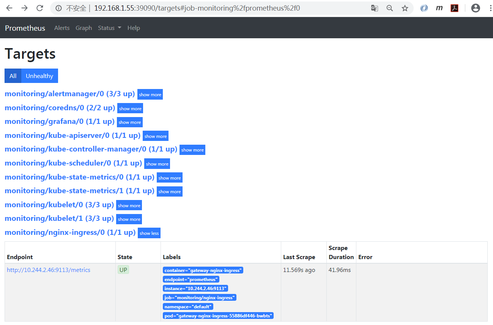

Prometheus已经出现Nginx Ingress相关的配置，job_name: monitoring/nginx-ingress/0。

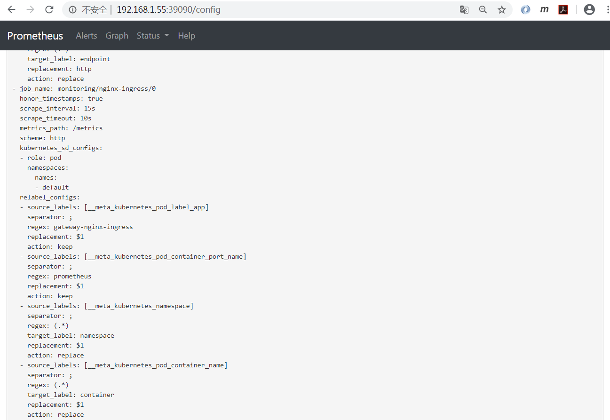

Prometheus监控指标irate(nginx_ingress_nginx_http_requests_total[1m])。

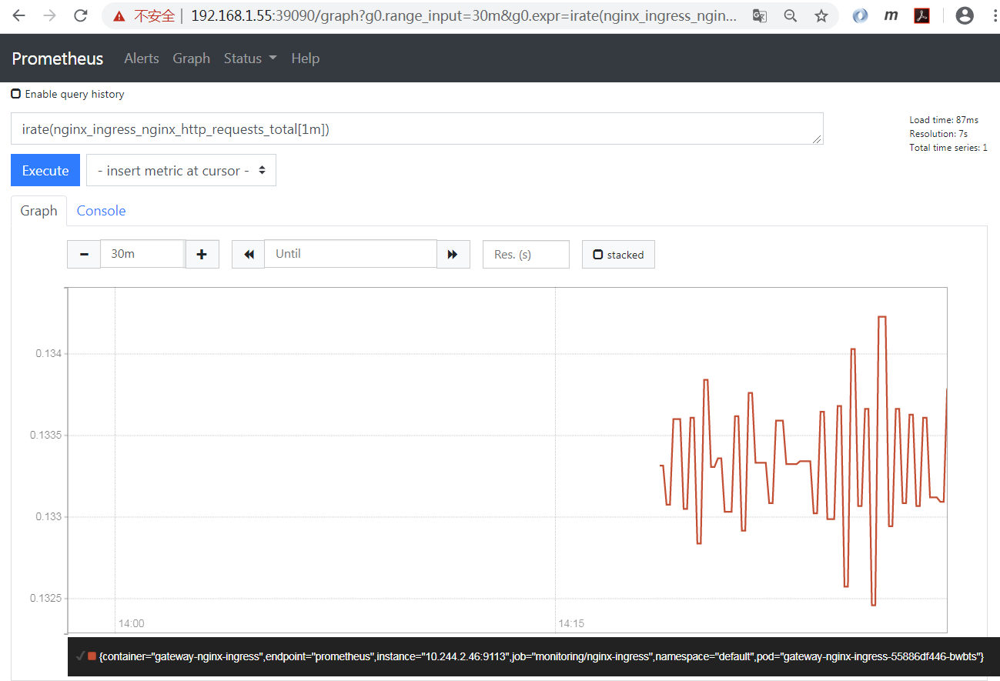

- ### 应用自定义监控-ServiceMonitor

我们仍旧以Nginx Ingress为例,我们先通过Helm部署。

先重新渲染模板来分析一下，Pod公开了prometheus端口"containerPort: 9113"，但Service没有公开该端口。而ServiceMonitor恰恰是是通过Service的prometheus端口拉取metrics数据的，所以我们通过controller.service.customPorts来向Service添加该端口。

    helm template gateway nginx/nginx-ingress \
      --set controller.service.type=NodePort \
      --set controller.service.httpPort.nodePort=30080 \
      --set controller.service.httpsPort.nodePort=30443
    ......
    # Source: nginx-ingress/templates/controller-service.yaml
    apiVersion: v1
    kind: Service
    metadata:
      name: gateway-nginx-ingress
      namespace: default
      labels:
        app.kubernetes.io/name: gateway-nginx-ingress
        helm.sh/chart: nginx-ingress-0.4.3
        app.kubernetes.io/managed-by: Helm
        app.kubernetes.io/instance: gateway
    spec:
      externalTrafficPolicy: Local
      type: NodePort
      ports:
      - port: 80
        targetPort: 80
        protocol: TCP
        name: http
        nodePort: 30080
      - port: 443
        targetPort: 443
        protocol: TCP
        name: https
        nodePort: 30443
      selector:
        app:  gateway-nginx-ingress
    ---
    # Source: nginx-ingress/templates/controller-deployment.yaml
    apiVersion: apps/v1
    kind: Deployment
    metadata:
      name: gateway-nginx-ingress
      namespace: default
      labels:
        app.kubernetes.io/name: gateway-nginx-ingress
        helm.sh/chart: nginx-ingress-0.4.3
        app.kubernetes.io/managed-by: Helm
        app.kubernetes.io/instance: gateway
    spec:
      replicas: 1
      selector:
        matchLabels:
          app: gateway-nginx-ingress
      template:
        metadata:
          labels:
            app: gateway-nginx-ingress
          annotations:
            prometheus.io/scrape: "true"
            prometheus.io/port: "9113"
        spec:
          serviceAccountName: gateway-nginx-ingress
          hostNetwork: false
          containers:
          - image: "nginx/nginx-ingress:1.6.3"
            name: gateway-nginx-ingress
            imagePullPolicy: "IfNotPresent"
            ports:
            - name: http
              containerPort: 80
            - name: https
              containerPort: 443
            - name: prometheus
              containerPort: 9113
    ......

根据上面的分析，设置以下覆盖参数来安装nginx-ingress。

    helm install gateway nginx/nginx-ingress \
      --set controller.service.type=NodePort \
      --set controller.service.httpPort.nodePort=30080 \
      --set controller.service.httpsPort.nodePort=30443 \
      --set controller.service.customPorts[0].port=9113 \
      --set controller.service.customPorts[0].targetPort=9113 \
      --set controller.service.customPorts[0].protocol=TCP \
      --set controller.service.customPorts[0].name=prometheus \
      --set controller.service.customPorts[0].nodePort=39113

查看Kubernetes资源，可以看出service/gateway-nginx-ingress暴露了9113端口。

    kubectl get all
    NAME                                         READY   STATUS    RESTARTS   AGE
    pod/gateway-nginx-ingress-55886df446-mwjs8   1/1     Running   0          10s
    
    NAME                            TYPE        CLUSTER-IP    EXTERNAL-IP   PORT(S)                                     AGE
    service/gateway-nginx-ingress   NodePort    10.1.98.109   <none>        9113:39113/TCP,80:30080/TCP,443:30443/TCP   10s
    service/kubernetes              ClusterIP   10.1.0.1      <none>        443/TCP                                     107d
    
    NAME                                    READY   UP-TO-DATE   AVAILABLE   AGE
    deployment.apps/gateway-nginx-ingress   1/1     1            1           10s
    
    NAME                                               DESIRED   CURRENT   READY   AGE
    replicaset.apps/gateway-nginx-ingress-55886df446   1         1         1       10s

可以访问metrics。

    curl http://192.168.1.55:39113/metrics
    # HELP nginx_ingress_controller_ingress_resources_total Number of handled ingress resources
    # TYPE nginx_ingress_controller_ingress_resources_total gauge
    nginx_ingress_controller_ingress_resources_total{type="master"} 0
    nginx_ingress_controller_ingress_resources_total{type="minion"} 0
    nginx_ingress_controller_ingress_resources_total{type="regular"} 0
    # HELP nginx_ingress_controller_nginx_last_reload_milliseconds Duration in milliseconds of the last NGINX reload
    # TYPE nginx_ingress_controller_nginx_last_reload_milliseconds gauge
    nginx_ingress_controller_nginx_last_reload_milliseconds 152
    # HELP nginx_ingress_controller_nginx_last_reload_status Status of the last NGINX reload
    # TYPE nginx_ingress_controller_nginx_last_reload_status gauge
    nginx_ingress_controller_nginx_last_reload_status 1
    # HELP nginx_ingress_controller_nginx_reload_errors_total Number of unsuccessful NGINX reloads
    # TYPE nginx_ingress_controller_nginx_reload_errors_total counter
    nginx_ingress_controller_nginx_reload_errors_total 0
    # HELP nginx_ingress_controller_nginx_reloads_total Number of successful NGINX reloads
    # TYPE nginx_ingress_controller_nginx_reloads_total counter
    nginx_ingress_controller_nginx_reloads_total 2
    # HELP nginx_ingress_controller_virtualserver_resources_total Number of handled VirtualServer resources
    # TYPE nginx_ingress_controller_virtualserver_resources_total gauge
    nginx_ingress_controller_virtualserver_resources_total 0
    # HELP nginx_ingress_controller_virtualserverroute_resources_total Number of handled VirtualServerRoute resources
    # TYPE nginx_ingress_controller_virtualserverroute_resources_total gauge
    nginx_ingress_controller_virtualserverroute_resources_total 0
    # HELP nginx_ingress_nginx_connections_accepted Accepted client connections
    # TYPE nginx_ingress_nginx_connections_accepted counter
    nginx_ingress_nginx_connections_accepted 5
    ......

查看Prometheus自定义资源，Prometheus根据serviceMonitorSelector关联ServiceMonitor，如果serviceMonitorSelector没有定义，那意味着会关联所有的ServiceMonitor。

    kubectl get prometheuses.monitoring.coreos.com/k8s -nmonitoring -oyaml
    apiVersion: monitoring.coreos.com/v1
    kind: Prometheus
    metadata:
      annotations:
        kubectl.kubernetes.io/last-applied-configuration: |
          {"apiVersion":"monitoring.coreos.com/v1","kind":"Prometheus","metadata":{"annotations":{},"labels":{"prometheus":"k8s"},"name":"k8s","namespace":"monitoring"},"spec":{"alerting":{"alertmanagers":[{"name":"alertmanager-main","namespace":"monitoring","port":"web"}]},"baseImage":"quay.io/prometheus/prometheus","nodeSelector":{"kubernetes.io/os":"linux"},"podMonitorSelector":{},"replicas":2,"resources":{"requests":{"memory":"400Mi"}},"ruleSelector":{"matchLabels":{"prometheus":"k8s","role":"alert-rules"}},"securityContext":{"fsGroup":2000,"runAsNonRoot":true,"runAsUser":1000},"serviceAccountName":"prometheus-k8s","serviceMonitorNamespaceSelector":{},"serviceMonitorSelector":{},"version":"v2.11.0"}}
      creationTimestamp: "2020-03-26T13:09:35Z"
      generation: 1
      labels:
        prometheus: k8s
      name: k8s
      namespace: monitoring
      resourceVersion: "15195"
      selfLink: /apis/monitoring.coreos.com/v1/namespaces/monitoring/prometheuses/k8s
      uid: 802c8f09-95e8-43e8-a2ea-131877fc6b4e
    spec:
      alerting:
        alertmanagers:
        - name: alertmanager-main
          namespace: monitoring
          port: web
      baseImage: quay.io/prometheus/prometheus
      nodeSelector:
        kubernetes.io/os: linux
      podMonitorSelector: {}
      replicas: 2
      resources:
        requests:
          memory: 400Mi
      ruleSelector:
        matchLabels:
          prometheus: k8s
          role: alert-rules
      securityContext:
        fsGroup: 2000
        runAsNonRoot: true
        runAsUser: 1000
      serviceAccountName: prometheus-k8s
      serviceMonitorNamespaceSelector: {}
      serviceMonitorSelector: {}
      version: v2.11.0

创建ServiceMonitor。其中几个需要注意的关键点。
- ServiceMonitor的name最终会反应到Prometheus的配置中，作为job_name。
- 如果Prometheus自定义资源中定义了serviceMonitorSelector，ServiceMonitor就需要有对应的标签，由此上面的Prometheus自定义资源没有定义serviceMonitorSelector，所以此处没有要求。
- ServiceMonitor的命名空间必须和Prometheus所在的命名空间相同，此处为monitoring。
- endpoints.interval为抓取间隔。
- endpoints.port需要和Service中的拉取metrics的ports.name对应，此处为prometheus。
- namespaceSelector.matchNames需要和被监控的Service所在的命名空间相同，此处为default。
- selector.matchLabels的标签必须和被监控的Service中能唯一标明身份的标签对应。

创建nginx-ingress服务对应的ServiceMonitor。

    vi prometheus-serviceMonitorNginxIngress.yaml
    apiVersion: monitoring.coreos.com/v1
    kind: ServiceMonitor
    metadata:
      labels:
        app: nginx-ingress
      name: nginx-ingress
      namespace: monitoring
    spec:
      endpoints:
      - interval: 15s
        port: prometheus
      namespaceSelector:
        matchNames:
        - default
      selector:
        matchLabels:
          app.kubernetes.io/name: gateway-nginx-ingress
    
    kubectl apply -f prometheus-serviceMonitorNginxIngress.yaml

此ServiceMonitor其实就是一个配置文件，Prometheus Operator会根据ServiceMonitor进行Prometheus的相关配置，自动对该服务进行监控。到Prometheus查看监控目标。注意此处有`service="gateway-nginx-ingress"`标明是对服务的监控。

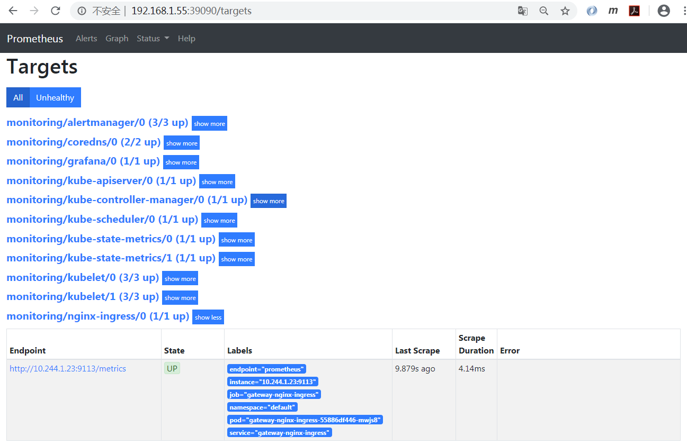

Prometheus已经出现Nginx Ingress相关的配置，`job_name: monitoring/nginx-ingress/0`。

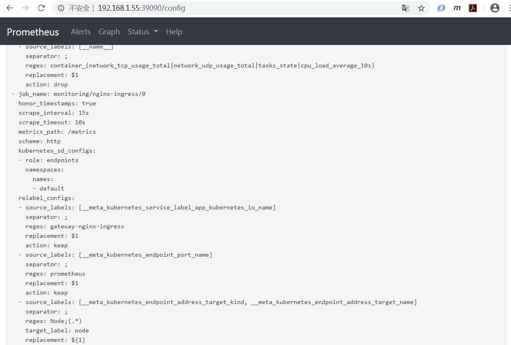

Prometheus监控指标`irate(nginx_ingress_nginx_http_requests_total[1m])`。

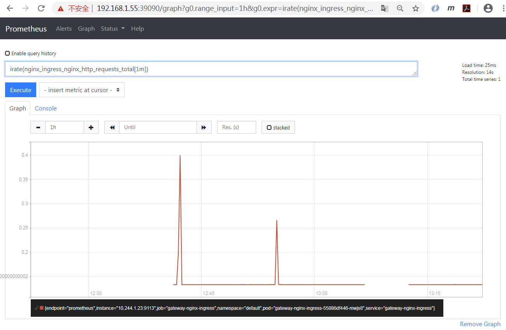
