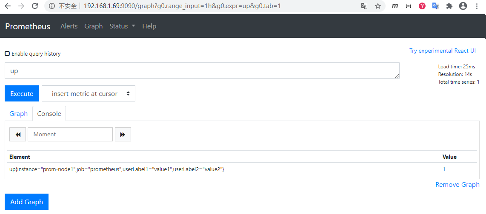

# Prometheus Relabel配置

### 环境准备

`--web.enable-lifecycle`：开启支持热加载，修改prometheus.yml配置文件，通过执行`curl -X POST http://192.168.1.69:9090/-/reload`就会热加载。

`--web.enable-admin-api`：开启对admin api的访问权限。

    vi /etc/systemd/system/prometheus.service
    [Unit]
    Description=prometheus
    After=network.target
    
    [Service]
    Type=simple
    User=root
    ExecStart=/usr/local/prometheus/prometheus/prometheus \
      --config.file=/usr/local/prometheus/prometheus/prometheus.yml \
      --web.enable-lifecycle \
      --web.enable-admin-api
    ExecReload=/bin/kill -HUP $MAINPID
    Restart=on-failure

    [Install]
    WantedBy=multi-user.target

    systemctl daemon-reload
    systemctl restart prometheus

为了简化，prometheus.yml中只保留一个job。其中可以看到自定义了一个`instance: prom-node1`标签。

    vi /usr/local/prometheus/prometheus/prometheus.yml
    global:
      scrape_interval:     15s
      evaluation_interval: 15s
    
    scrape_configs:
      - job_name: 'prometheus'
        static_configs:
        - targets: ['192.168.1.69:9090']
          labels:
            instance: prom-node1

    curl -X POST http://192.168.1.69:9090/-/reload

查询生效的targets。

    curl http://192.168.1.69:9090/api/v1/targets -s | python -m json.tool
    {
        "data": {
            "activeTargets": [
                {
                    "discoveredLabels": {
                        "__address__": "192.168.1.69:9090",
                        "__metrics_path__": "/metrics",
                        "__scheme__": "http",
                        "instance": "prom-node1",
                        "job": "prometheus"
                    },
                    "health": "up",
                    "labels": {
                        "instance": "prom-node1",
                        "job": "prometheus"
                    },
                    "lastError": "",
                    "lastScrape": "2020-07-16T21:33:31.059376471+08:00",
                    "lastScrapeDuration": 0.011171916,
                    "scrapePool": "prometheus",
                    "scrapeUrl": "http://192.168.1.69:9090/metrics"
                }
            ],
            "droppedTargets": []
        },
        "status": "success"
    }

可以看到discoveredLabels中会自动增加几个系统默认标签，`__address__`、`__metrics_path__`和`__scheme__`，还有job名称也被自动增加为默认标签。

- `__address__`：当前target实例的访问地址<host>:<port>。

- `__metrics_path__`：采集目标服务访问地址的HTTP Scheme，取值为HTTP或者HTTPS。

- `__scheme__`：采集目标服务访问地址的路径。

- `__param_<name>`：采集任务目标服务中包含的请求参数，如`http://ip:port/metrics?lable_name=value`。

- `__name__`：此标签是标识指标名称的预留标签。

而labels中有两个标签，instance和job，其中job名称标签会默认增加，instance实际上也是系统默认标签，只不过其值可以自定义，如果没有定义其值，默认为`instance=ip:port`。

discoveredLabels为该服务发现的所有标签，包括该服务发现系统默认标签和自定标签。但discoveredLabels并不会自动出现在时序数据的标签中，discoveredLabels中的标签可以在relabel中使用。

labels是最终的标签，labels都会出现在时序数据的标签中。

在配置中增加两个自定义标签。

    vi /usr/local/prometheus/prometheus/prometheus.yml
    global:
      scrape_interval:     15s
      evaluation_interval: 15s
    
    scrape_configs:
      - job_name: 'prometheus'
        static_configs:
        - targets: ['192.168.1.69:9090']
          labels:
            instance: prom-node1
            userLabel1: value1
            userLabel2: value2

    curl -X POST http://192.168.1.69:9090/-/reload

可以看到discoveredLabels和labels中出现了该标签。

    curl http://192.168.1.69:9090/api/v1/targets -s | python -m json.tool
    {
        "data": {
            "activeTargets": [
                {
                    "discoveredLabels": {
                        "__address__": "192.168.1.69:9090",
                        "__metrics_path__": "/metrics",
                        "__scheme__": "http",
                        "instance": "prom-node1",
                        "job": "prometheus",
                        "userLabel1": "value1",
                        "userLabel2": "value2"
                    },
                    "health": "unknown",
                    "labels": {
                        "instance": "prom-node1",
                        "job": "prometheus",
                        "userLabel1": "value1",
                        "userLabel2": "value2"
                    },
                    "lastError": "",
                    "lastScrape": "0001-01-01T00:00:00Z",
                    "lastScrapeDuration": 0,
                    "scrapePool": "prometheus",
                    "scrapeUrl": "http://192.168.1.69:9090/metrics"
                }
            ],
            "droppedTargets": []
        },
        "status": "success"
    }

可以看到时序数据中确实出现了该标签。

### Relabel配置

这种发生在采集样本数据之前，对target实例的标签进行重写的机制在Prometheus中被称为Relabeling。Prometheus允许用户在采集任务设置中通过relabel_configs来添加自定义的Relabeling过程。

    <relabel_config>
      # 源标签从现有标签中选择值。 它们的内容使用已配置的分隔符进行连接，并与已配置的正则表达式进行匹配，以进行替换，保留和删除操作。
      [ source_labels: '[' <labelname> [, ...] ']' ]

      # 分隔符放置在连接的源标签值之间。
      [ separator: <string> | default = ; ]

      # 在替换操作中将结果值写入的标签。
      # 替换操作是强制性的。 正则表达式捕获组可用。
      [ target_label: <labelname> ]

      # 与提取的值匹配的正则表达式。
      [ regex: <regex> | default = (.*) ]

      # 采用源标签值的散列的模数。
      [ modulus: <uint64> ]

      # 如果正则表达式匹配，则执行正则表达式替换的替换值。 正则表达式捕获组可用。
      [ replacement: <string> | default = $1 ]

      # 基于正则表达式匹配执行的操作。
      [ action: <relabel_action> | default = replace ]
    </relabel_config>

#### replace

使用source_labels的值替换target_label的值，默认名action为replace，可以不用出现。

    vi /usr/local/prometheus/prometheus/prometheus.yml
    global:
      scrape_interval:     15s
      evaluation_interval: 15s
    
    scrape_configs:
      - job_name: 'prometheus'
        static_configs:
        - targets: ['192.168.1.69:9090']
          labels:
            instance: prom-node1
            userLabel1: value1
            userLabel2: value2
        relabel_configs:
        - source_labels: [userLabel1]
          target_label: userLabel2
    
    curl -X POST http://192.168.1.69:9090/-/reload

可以看到userLabel2的值被替换为value1。

    curl http://192.168.1.69:9090/api/v1/targets -s | python -m json.tool
    {
        "data": {
            "activeTargets": [
                {
                    "discoveredLabels": {
                        "__address__": "192.168.1.69:9090",
                        "__metrics_path__": "/metrics",
                        "__scheme__": "http",
                        "instance": "prom-node1",
                        "job": "prometheus",
                        "userLabel1": "value1",
                        "userLabel2": "value2"
                    },
                    "health": "unknown",
                    "labels": {
                        "instance": "prom-node1",
                        "job": "prometheus",
                        "userLabel1": "value1",
                        "userLabel2": "value1"
                    },
                    "lastError": "",
                    "lastScrape": "0001-01-01T00:00:00Z",
                    "lastScrapeDuration": 0,
                    "scrapePool": "prometheus",
                    "scrapeUrl": "http://192.168.1.69:9090/metrics"
                }
            ],
            "droppedTargets": []
        },
        "status": "success"
    }

再看一个例子。

    vi /usr/local/prometheus/prometheus/prometheus.yml
    global:
      scrape_interval:     15s
      evaluation_interval: 15s

    scrape_configs:
      - job_name: 'prometheus'
        static_configs:
        - targets: ['192.168.1.69:9090']
          labels:
            instance: prom-node1
            userLabel1: value1
            userLabel2: value2
        relabel_configs:
        - source_labels: [userLabel1]
          regex: 'value([0-9]+)'
          target_label: userLabel2
          replacement: '$1'
          action: replace

    curl -X POST http://192.168.1.69:9090/-/reload

    curl http://192.168.1.69:9090/api/v1/targets -s | python -m json.tool
    {
        "data": {
            "activeTargets": [
                {
                    "discoveredLabels": {
                        "__address__": "192.168.1.69:9090",
                        "__metrics_path__": "/metrics",
                        "__scheme__": "http",
                        "instance": "prom-node1",
                        "job": "prometheus",
                        "userLabel1": "value1",
                        "userLabel2": "value2"
                    },
                    "health": "unknown",
                    "labels": {
                        "instance": "prom-node1",
                        "job": "prometheus",
                        "userLabel1": "value1",
                        "userLabel2": "1"
                    },
                    "lastError": "",
                    "lastScrape": "0001-01-01T00:00:00Z",
                    "lastScrapeDuration": 0,
                    "scrapePool": "prometheus",
                    "scrapeUrl": "http://192.168.1.69:9090/metrics"
                }
            ],
            "droppedTargets": []
        },
        "status": "success"
    }

#### labelkeep/labeldrop

使用labelkeep/labeldrop则可以对target标签进行过滤，仅保留符合过滤条件的标签。

    vi /usr/local/prometheus/prometheus/prometheus.yml
    global:
      scrape_interval:     15s
      evaluation_interval: 15s

    scrape_configs:
      - job_name: 'prometheus'
        static_configs:
        - targets: ['192.168.1.69:9090']
          labels:
            instance: prom-node1
            userLabel1: value1
            userLabel2: value2
        relabel_configs:
        - regex: userLabel1
          action: labeldrop

    curl -X POST http://192.168.1.69:9090/-/reload

    curl http://192.168.1.69:9090/api/v1/targets -s | python -m json.tool
    {
        "data": {
            "activeTargets": [
                {
                    "discoveredLabels": {
                        "__address__": "192.168.1.69:9090",
                        "__metrics_path__": "/metrics",
                        "__scheme__": "http",
                        "instance": "prom-node1",
                        "job": "prometheus",
                        "userLabel1": "value1",
                        "userLabel2": "value2"
                    },
                    "health": "up",
                    "labels": {
                        "instance": "prom-node1",
                        "job": "prometheus",
                        "userLabel2": "value2"
                    },
                    "lastError": "",
                    "lastScrape": "2020-07-16T22:26:01.88287593+08:00",
                    "lastScrapeDuration": 0.024094524,
                    "scrapePool": "prometheus",
                    "scrapeUrl": "http://192.168.1.69:9090/metrics"
                }
            ],
            "droppedTargets": []
        },
        "status": "success"
    }

#### labelmap

将regex与所有标签名称匹配，然后将匹配标签的名称替换为replacement指定的值，注意是标签名称。

    vi /usr/local/prometheus/prometheus/prometheus.yml
    global:
      scrape_interval:     15s
      evaluation_interval: 15s

    scrape_configs:
      - job_name: 'prometheus'
        static_configs:
        - targets: ['192.168.1.69:9090']
          labels:
            instance: prom-node1
            userLabel1: value1
            userLabel2: value2
        relabel_configs:
        - regex: use(.*)1
          replacement: '$1'
          action: labelmap

    curl -X POST http://192.168.1.69:9090/-/reload

    curl http://192.168.1.69:9090/api/v1/targets -s | python -m json.tool
    {
        "data": {
            "activeTargets": [
                {
                    "discoveredLabels": {
                        "__address__": "192.168.1.69:9090",
                        "__metrics_path__": "/metrics",
                        "__scheme__": "http",
                        "instance": "prom-node1",
                        "job": "prometheus",
                        "userLabel1": "value1",
                        "userLabel2": "value2"
                    },
                    "health": "up",
                    "labels": {
                        "instance": "prom-node1",
                        "job": "prometheus",
                        "rLabel": "value1",
                        "userLabel1": "value1",
                        "userLabel2": "value2"
                    },
                    "lastError": "",
                    "lastScrape": "2020-07-16T22:31:08.353191153+08:00",
                    "lastScrapeDuration": 0.027295032,
                    "scrapePool": "prometheus",
                    "scrapeUrl": "http://192.168.1.69:9090/metrics"
                }
            ],
            "droppedTargets": []
        },
        "status": "success"
    }

#### keep/drop

当action设置为keep时，Prometheus会保留source_labels的值中匹配到regex正则表达式内容的target实例，但会丢弃source_labels的值中没有匹配到regex正则表达式内容的target实例。

而当action设置为drop时，则会丢弃source_labels的值匹配到regex正则表达式内容的target实例。

    vi /usr/local/prometheus/prometheus/prometheus.yml
    global:
      scrape_interval:     15s
      evaluation_interval: 15s

    scrape_configs:
      - job_name: 'prometheus'
        static_configs:
        - targets: ['192.168.1.69:9090']
          labels:
            instance: prom-node1
            userLabel1: value1
            userLabel2: value2
        relabel_configs:
        - source_labels: [userLabel1]
          action: drop

    curl -X POST http://192.168.1.69:9090/-/reload

此时可以发现target已经不在激活状态，而是被dropped了。

    curl http://192.168.1.69:9090/api/v1/targets -s | python -m json.tool
    {
        "data": {
            "activeTargets": [],
            "droppedTargets": [
                {
                    "discoveredLabels": {
                        "__address__": "192.168.1.69:9090",
                        "__metrics_path__": "/metrics",
                        "__scheme__": "http",
                        "instance": "prom-node1",
                        "job": "prometheus",
                        "userLabel1": "value1",
                        "userLabel2": "value2"
                    }
                }
            ]
        },
        "status": "success"
    }

再看keep例子。

    vi /usr/local/prometheus/prometheus/prometheus.yml
    global:
      scrape_interval:     15s
      evaluation_interval: 15s

    scrape_configs:
      - job_name: 'prometheus'
        static_configs:
        - targets: ['192.168.1.69:9090']
          labels:
            instance: prom-node1
            userLabel1: value1
            userLabel2: value2
        relabel_configs:
        - source_labels: ["userLabel1"]
          regex: "value.*"
          action: keep

    curl -X POST http://192.168.1.69:9090/-/reload

    curl http://192.168.1.69:9090/api/v1/targets?active -s | python -m json.tool
    {
        "data": {
            "activeTargets": [
                {
                    "discoveredLabels": {
                        "__address__": "192.168.1.69:9090",
                        "__metrics_path__": "/metrics",
                        "__scheme__": "http",
                        "instance": "prom-node1",
                        "job": "prometheus",
                        "userLabel1": "value1",
                        "userLabel2": "value2"
                    },
                    "health": "up",
                    "labels": {
                        "instance": "prom-node1",
                        "job": "prometheus",
                        "userLabel1": "value1",
                        "userLabel2": "value2"
                    },
                    "lastError": "",
                    "lastScrape": "2020-07-17T22:00:46.611126082+08:00",
                    "lastScrapeDuration": 0.026697485,
                    "scrapePool": "prometheus",
                    "scrapeUrl": "http://192.168.1.69:9090/metrics"
                }
            ],
            "droppedTargets": []
        },
        "status": "success"
    }
